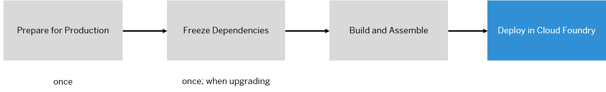
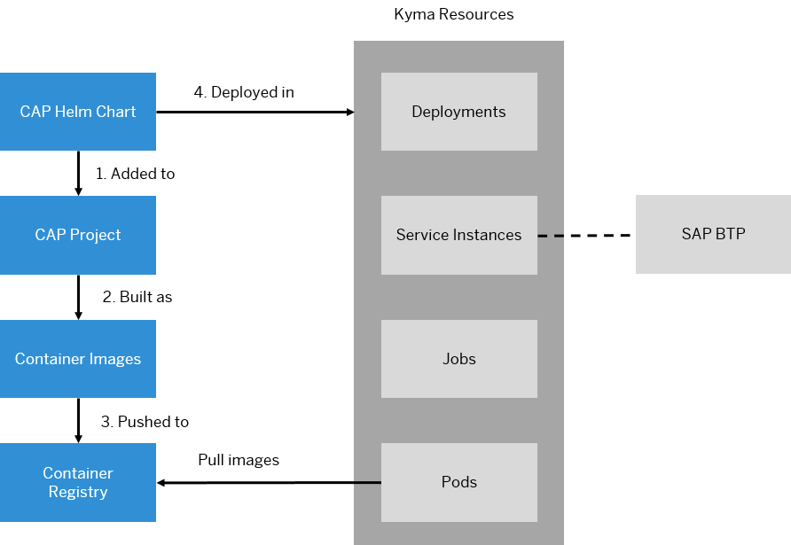

<!-- loio45d5acf602064061843da43f0b800e1e -->

# Deploy

SAP Application Programming Model \(CAP\) applications can be deployed in the SAP BTP, Cloud Foundry runtime or in the SAP BTP, Kyma runtime. Both runtimes can be used to host and run your custom code, while at the same time being connected to SAP BTP Multi-Cloud Services and your on-premise systems. Depending on your use case and the skill set of your developers, choose the runtime that fits your needs. See [Comparison: SAP BTP, Kyma Runtime and SAP BTP, Cloud Foundry Runtime](https://help.sap.com/docs/btp/comparison-kyma-runtime-and-cloud-foundry-runtime/runtime-comparison?version=Cloud).

<a name="loio45d5acf602064061843da43f0b800e1e__section_k1z_rrv_czb"/>

## Deploy in Cloud Foundry Runtime

After completing the functional implementation of the CAP application by following the best practices, you can deploy your application in the cloud for productive usage. The essential steps are illustrated in the following graphic:

With our recommended approach, the actual deployment in your SAP BTP, Cloud Foundry runtime is performed either by your [Continuous Integration and Continuous Delivery](continuous-integration-and-continuous-delivery-d973132.md) pipeline \(such as being provided by SAP Continuous Integration and Delivery service\) or handled by transports \(via [SAP Cloud Transport Management](https://help.sap.com/docs/cloud-transport-management?version=Cloud), optionally orchestrated by SAP Cloud ALM\).

If you want to perform a manual deployment in the SAP BTP, Cloud Foundry runtime, see [Deploy in Cloud Foundry](https://cap.cloud.sap/docs/guides/deployment/to-cf).

<a name="loio45d5acf602064061843da43f0b800e1e__section_knx_xrv_czb"/>

## Deploy in Kyma Runtime

Like Kubernetes, Kyma is a platform to run containerized workloads. The service's files are provided as a container image, commonly referred to as a Docker image. In addition, the containers to be run on Kubernetes, their configuration and everything else that is needed to run them, are described in the Kubernetes resources.

In consequence, two kinds of artifacts are needed to run applications on Kubernetes:

-   Container images

-   Kubernetes resources

The following diagram shows the steps to run on the SAP BTP, Kyma runtime:

For detailed steps to deploying your application in the SAP BTP, Kyma runtime, see[Deploy in Kyma Runtime](https://cap.cloud.sap/docs/guides/deployment/deploy-to-kyma).

If you want to perform an automated deployment via pipeline, SAP Continuous Integration and Delivery has a ready-to-use pipeline for CAP on SAP BTP, Kyma runtime. See [Continuous Integration and Continuous Delivery](continuous-integration-and-continuous-delivery-d973132.md).

