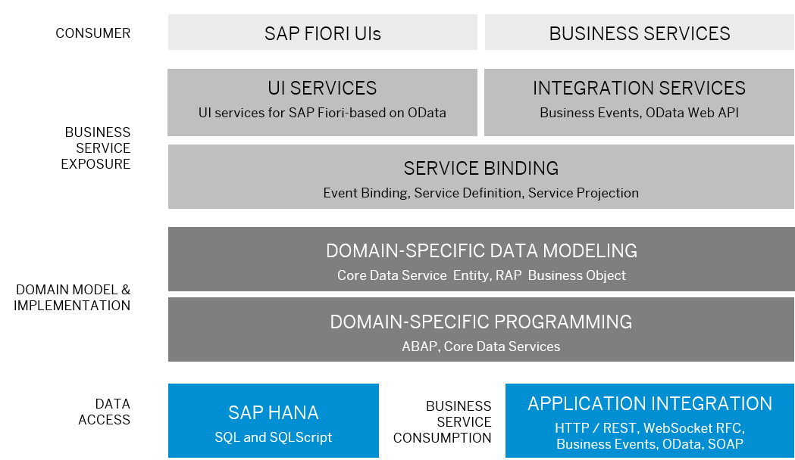

<!-- loio608432c551474546bf555388b65ee646 -->

# Design a Transactional Application

Transactional applications and services implement use cases where read, create, update, or delete operations on the data set are required.

A transactional application consists of a client, the business service exposure that defines the service that is consumed by the client, domain-specific models and domain-specific logic that implements behavior. Data is either accessed from the SAP HANA database or with the service consumption model from remote services.

The following graphic gives you an overview of the main parts of the transactional application’s architecture:

The client is either an SAP Fiori elements or SAPUI5 application or any API consumer.

In the business service exposure the kind of service that is exposed is defined. A UI service is an OData service specifically designed to cater to SAP Fiori elements consumers but is used for OData UI consumers in general. API services expose the underlying data- and behavior-models as APIs to unspecified clients either with the OData protocol or business events. It is possible to define both UI and API services at the same time.

The ABAP RESTful Application Programming Model \(RAP\) is used to create UI and API services including the domain model and implementation. The center piece of RAP is the business object. RAP's business objects consist of the data model implemented with the core data services and the transactional behavior implemented with the Entity Manipulation Language \(EML\).

The architectural separation of concerns between the domain-specific implementation and the business service exposure allows you to expose the same data model for analytical and transactional applications and services.