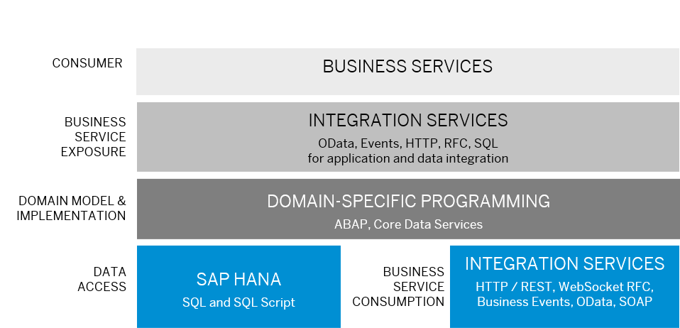

<!-- loioec2ac31291ba4f4e97c50a38d7b87898 -->

# Design an Integration Service

Integration Services implement system-to-system communication use cases to enable data or process integration between systems across a range of different protocols and frameworks.

You can use data integration to exchange data between two or more parties without being part of specific and predefined business process, for example, for analytical use cases.

Process integration requirements can span data exchange across system boundaries like, for example, to trigger follow-on actions with events when a value in an app is changed.

