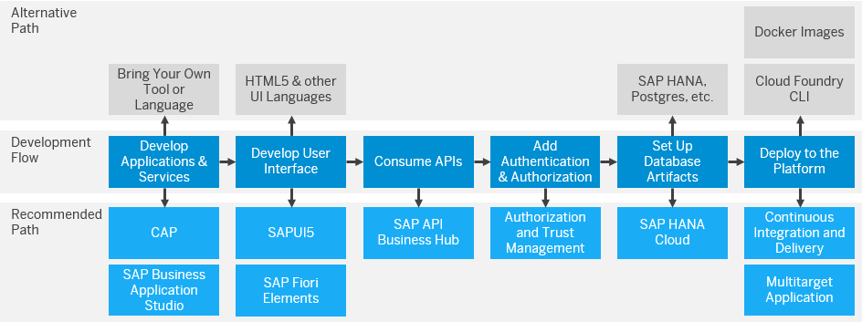

<!-- loio58df1d6d44c44f83a7f925dcc8384b13 -->

# Develop

Learn more about developing applications using SAP Cloud Application Programming Model \(CAP\).

<a name="loio58df1d6d44c44f83a7f925dcc8384b13__section_znq_125_czb"/>

## SAP Cloud Application Programming Model \(CAP\)

SAP Cloud Application Programming Model \(CAP\) is a framework of languages, libraries, and tools for building enterprise-grade services and applications. It guides you along the best practices you can use to develop your applications on SAP BTP.

Core Data and Services can be used as business level data definition source, and to generate the artifacts at the persistence layer, generate the application service layer and also be used to define visual aspects relating to the data, with those definitions \(annotations\) defining the UI layer. See [Core Data and Services \(CDS\) Language Reference Documentation](https://help.sap.com/docs/btp/sap-business-technology-platform/core-data-and-services-cds-language-reference-documentation?version=Cloud).

CAP framework provides strong support for programming languages like Node.js and Java allowing you to build server-side logic, handle requests and responses.

The following is the list of the most prominent tasks within scope of developing a full-stack application using CAP.

-   Domain modeling

    Most projects start with capturing the essential objects of their domain in a respective domain model. Find here an introduction to the basics of domain modeling with Core Data and Services, complemented with recommended best practices. See [Domain Modeling](https://cap.cloud.sap/docs/guides/domain-modeling).

-   Providing services

    This learn how to define and implement services, leveraging generic implementations provided by the CAP runtimes, complemented by domain-specific custom logic, see [Providing Services](https://cap.cloud.sap/docs/guides/providing-services).

-   Development of user interface

    To learn how to create applications with rich user interfaces for modern Web business applications, responsive across browsers and devices, based on HTML5, see [Developing Apps](https://sapui5.hana.ondemand.com/#/topic/23cfd955f58142389fa7c9097e11559c).

-   Consuming services

    To learn how to use uniform APIs to consume local or remote services, see [Consuming Services](https://cap.cloud.sap/docs/guides/using-services).

-   Databases

    To learn how to use databases with CAP applications, see [Using Databases](https://cap.cloud.sap/docs/guides/databases).

    Out of the box-support is provided for SAP HANA, SQLite, H2 \(Java only\), and PostgreSQL.

-   Messaging

    CAP provides intrinsic support for emitting and receiving events. This is complemented by the messaging services connecting to message brokers to exchange event messages across remote services. See [Events and Messaging](https://cap.cloud.sap/docs/guides/messaging/).

-   Authentication

    Authenticating users on incoming HTTP requests is achieved by authentication middleware which is then used in authorization enforcement decisions. See [Authentication](https://cap.cloud.sap/docs/node.js/authentication).

-   Authorization

    To restrict access to data by adding respective declarations to the models of the Core Data and Services, which are then enforced in service implementations, see [Authorization and Access Control](https://cap.cloud.sap/docs/guides/authorization).

-   Localization, and internationalization

    To internationalize your application to provide localized versions with respect to both Localized Models as well as Localized Data, see [Localization, i18n](https://cap.cloud.sap/docs/guides/i18n).

-   Localized data

    To localize and internationalize static content, such as labels or messages, and to serve localized versions of actual application data, see [Localized Data](https://cap.cloud.sap/docs/guides/localized-data).

-   Temporal data

    CAP provides out-of-the-box support for declaring and serving date-effective entities with application-controlled validity, in particular to serve as-of-now and time-travel queries. See [Temporal Data](https://cap.cloud.sap/docs/guides/temporal-data).

-   Media data

    CAP provides out-of-the-box support for serving media and other binary data. See [Serving Media Data](https://cap.cloud.sap/docs/guides/media-data).

-   Data privacy

    CAP helps application projects to comply with data privacy regulations using SAP BTP services. See [Managing Data Privacy](https://cap.cloud.sap/docs/guides/data-privacy/).

-   Security

    To develop, deploy and operate CAP applications in a secure way, see [CAP Security Guide](https://cap.cloud.sap/docs/guides/security/).

-   Multitenancy

    Get to know the fundamental concepts of multitenancy, underpinning SaaS solutions in CAP. To learn how to run and test applications in multitenancy mode with minimized setup and overhead, see [Multitenancy](https://cap.cloud.sap/docs/guides/multitenancy/).

-   Extensibility

    Learn about the intrinsic capabilities to extend your applications in verticalization and customization scenarios. See [Extensibility](https://cap.cloud.sap/docs/guides/extensibility/).

-   Test

    To learn how to test a CAP application, see [Testing with cds.test](https://cap.cloud.sap/docs/node.js/cds-test).

<a name="loio58df1d6d44c44f83a7f925dcc8384b13__section_jms_z5d_53b"/>

## Runtimes

****

<table>
<tr>
<th valign="top">

</th>
<th valign="top">

Cloud Foundry

</th>
<th valign="top">

Kyma

</th>
</tr>
<tr>
<td valign="top">

</td>
<td valign="top">

SAP BTP, Cloud Foundry environment is an open Platform-as-a-Service \(PaaS\) targeted at microservice development and orchestration.

</td>
<td valign="top">

SAP BTP, Kyma runtime is a fully managed Kubernetes-based runtime that enables the development and operation of cloud-native, enterprise-garde applications that can seamlessly consume Multi-Cloud Foundation Services.

</td>
</tr>
<tr>
<td valign="top">

Develop polyglot applications

</td>
<td valign="top">

Build on open standards with SAP Java, Node.js, and Python buildpacks or bring your own language with community buildpacks for PHP, Ruby, Go.

</td>
<td valign="top">

With Kyma, you can choose any preferred language or application that can be containerized. The available Kyma modules reduce the development effort and the application time to market.

</td>
</tr>
<tr>
<td valign="top">

Manage the lifecycle of applications

</td>
<td valign="top">

Start, stop, scale, and configure distributed cloud applications using standard Cloud Foundry tools, our web-based administration user interface for SAP BTP, and dev-ops capabilities.

</td>
<td valign="top">

Deploy and upgrade applications and take advantage of the native autoscaling functionality of Kubernetes that manages the scaling for you. Get familiar with our user interface, Kyma Dashboard, or automate with standard CI/CD tools most of which support Kubernetes.

</td>
</tr>
<tr>
<td valign="top">

Optimize development and operations

</td>
<td valign="top">

Use the rich set of SAP BTP services including messaging, persistence, and many other capabilities.

</td>
<td valign="top">

As Kyma is fully managed, upgrades for your Kubernetes cluster and base images are handled for you to save you time.

</td>
</tr>
<tr>
<td valign="top">

Use the application programming model

</td>
<td valign="top" colspan="2">

Use programming languages, libraries, and APIs tailored for full-stack application development.

</td>
</tr>
</table>

<a name="loio58df1d6d44c44f83a7f925dcc8384b13__section_wqt_z5l_tnb"/>

## Development Options Overview

The following graphic is designed to help you find the information you need for your programming purposes. The bottom row represents the tools, frameworks, services, and deployment options recommended by SAP. If you want full flexibility you can also bring your own development tools and languages, as shown in the top row.

<a name="loio58df1d6d44c44f83a7f925dcc8384b13__section_ifw_4vl_tnb"/>

## The Recommended Path

This development approach offers guidance for important development decisions and features proven best practices recommended by SAP. You can follow a model path for application and service development that is based on the Cloud Application Programming Model \(CAP\). When working with CAP, we recommend using Java and Node.js because they receive the highest level of tool support and are well suited for most use cases. This path provides you with a list of key aspects to consider, but the order shown in these steps isn't mandatory. You can adapt the steps as you wish to better fit your use case.

