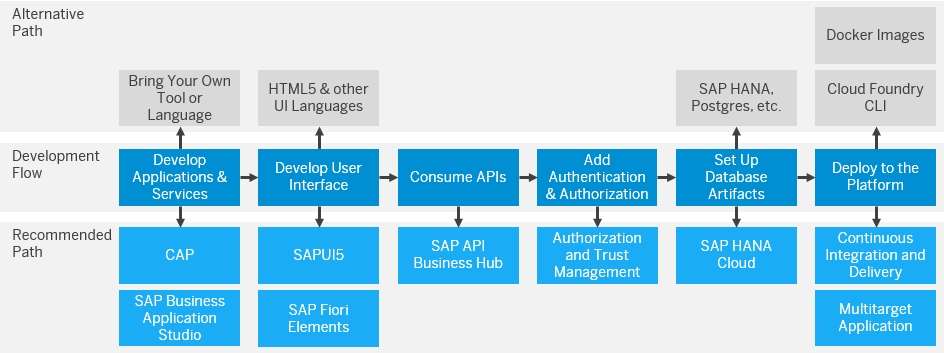

<!-- loio7e306865dadb4473a4d66d81b7d83004 -->

# Develop

When using SAP Cloud Application Programming Model \(CAP\), you can choose the right runtime of your use case: SAP BTP, Cloud Foundry runtime or SAP BTP, Kyma runtime. To make an informed decision, see:

-   [SAP BTP, Cloud Foundry and SAP BTP, Kyma Runtimes with CAP](sap-btp-cloud-foundry-and-sap-btp-kyma-runtimes-with-cap-0f9cfe9.md)
-   [Comparison: SAP BTP, Kyma Runtime and SAP BTP, Cloud Foundry Runtime](https://help.sap.com/docs/btp/comparison-btp-runtimes/runtime-comparison?version=Cloud)

Metering:

-   Cloud Foundry runtime: Metering starts when you start using the runtime memory, for example, when you deploy an application.

    If your global account uses the consumption-based commercial model and you want to understand how the consumption of SAP BTP, Cloud Foundry runtime is calculated, see [Consumption Monitoring](https://help.sap.com/docs/cf-runtime/cloud-foundry-runtime/monitoring-and-troubleshooting?version=Cloud) in the SAP BTP, Cloud Foundry runtime documentation.

-   Kyma runtime: Metering starts when you enable the Kyma runtime. This triggers the creation of a dedicated Kubernetes cluster, and the cluster is metered from the start, before you have deployed any applications.

For Cloud Foundry , we recommend that you create multitarget applications for managing dependencies more easily. For more information, see [Using Multitarget Applications to Manage Dependencies](using-multitarget-applications-to-manage-dependencies-41184aa.md).

For best practices, guidelines and step-by-step instructions, see [Development](https://help.sap.com/viewer/65de2977205c403bbc107264b8eccf4b/Cloud/en-US/c2fec62b49fa43b8bd945c85ecc2e5bd.html "Develop and run business applications on SAP Business Technology Platform (SAP BTP) using our cloud application programming model, APIs, services, tools, and capabilities.") :arrow_upper_right:.

<a name="loio7e306865dadb4473a4d66d81b7d83004__section_wqt_z5l_tnb"/>

## Development Options Overview

The following graphic is designed to help you find the information you need for your programming purposes. The bottom row represents the tools, frameworks, services, and deployment options recommended by SAP. If you want full flexibility you can also bring your own development tools and languages, as shown in the top row.

<a name="loio7e306865dadb4473a4d66d81b7d83004__section_fnv_kb3_r2b"/>

## Development Guidelines

To ensure consistency and foster collaboration between developers, we recommend that you define guidelines that include standards for programming principles, code styles, and naming conventions.

SAP provides the following official guidelines:

-   [SAPUI5 Guidelines](https://sapui5.netweaver.ondemand.com/sdk/#/topic)

-   [SAP Fiori Design Guidelines](https://experience.sap.com/fiori-design/)

<a name="loio7e306865dadb4473a4d66d81b7d83004__section_lbt_hjp_dcc"/>

## SAP BTP and Third-Party Cookies

The deprecation of third-party cookies by browser manufacturers might impact applications running on SAP BTP. For example, logon scenarios in your application might fail due to session management and authentication issues.

Third-party cookies are set by domains other than the one a user is directly visiting. They are commonly used for online advertising and tracking user behavior across multiple websites. In SAP BTP, SAP uses third-party cookies for service management and single sign-on.

Prepare your applications for the third-party cookie deprecation and test them. See [Preparing and Testing Your Solution for Third-Party Cookie Deprecation](https://help.sap.com/docs/BTP/65de2977205c403bbc107264b8eccf4b/70d545de1931484c9efbc2cda6519fa7.html).

All the available solutions are listed in the SAP Note [3409306 - Removal of Third-Party Cookies in Google Chrome and Microsoft Edge Browser](https://me.sap.com/notes/3409306).

<a name="loio7e306865dadb4473a4d66d81b7d83004__section_e41_5x1_mcc"/>

## Tutorials and End-to-End Scenarios

There are tutorials and end-to-end scenarios developed to show you how to apply the recommended path for the Cloud Application Programming Model \(CAP\). All these tutorials and scenarios are based on the Incident Management sample application. For a full list of the tutorials and their use cases, see [Tutorials for SAP Cloud Application Programming Model](tutorials-for-sap-cloud-application-programming-model-eb7420a.md).

**Related Information**  

[Programming Languages, Tools, and APIs](programming-languages-tools-and-apis-70bbcb4.md "")

[Security Considerations for Applications](security-considerations-for-applications-a73f6ff.md "When building applications, use the security features of SAP BTP, such as protection from web attacks. We recommend that your developers configure and deploy application-based security artifacts containing authorizations, and administrators assign these authorizations using the cockpit. SAP BTP offers platform roles that help you ensure a segregation of duties, such as between app development and administration.")

[Developing Resilient Applications](developing-resilient-applications-b1b929a.md "Our best practices about resilient application design help you to make your applications running on SAP BTP stable and highly available.")

[Using Multitarget Applications to Manage Dependencies](using-multitarget-applications-to-manage-dependencies-41184aa.md "One challenge of moving into the cloud is deploying applications that consist of multiple interconnected components.")

[Extending Existing SAP Solutions Using SAP BTP](extending-existing-sap-solutions-using-sap-btp-40aa232.md "SAP BTP offers services, tools, and capabilities to develop, extend, or integrate business applications in the cloud. You can implement additional workflows or modules on top of existing solutions, which lets you benefit from out-of-the-box security, inherited data access governance, user interface embedding, and so on.")

[Performing UI, Usability, and Unit Tests](performing-ui-usability-and-unit-tests-50a7c7d.md "You should always conduct careful testing to ensure that your application is of high quality. Create a release candidate to propagate throughout your landscape.")

[Connecting to Remote Systems](connecting-to-remote-systems-d61a5fc.md "")

