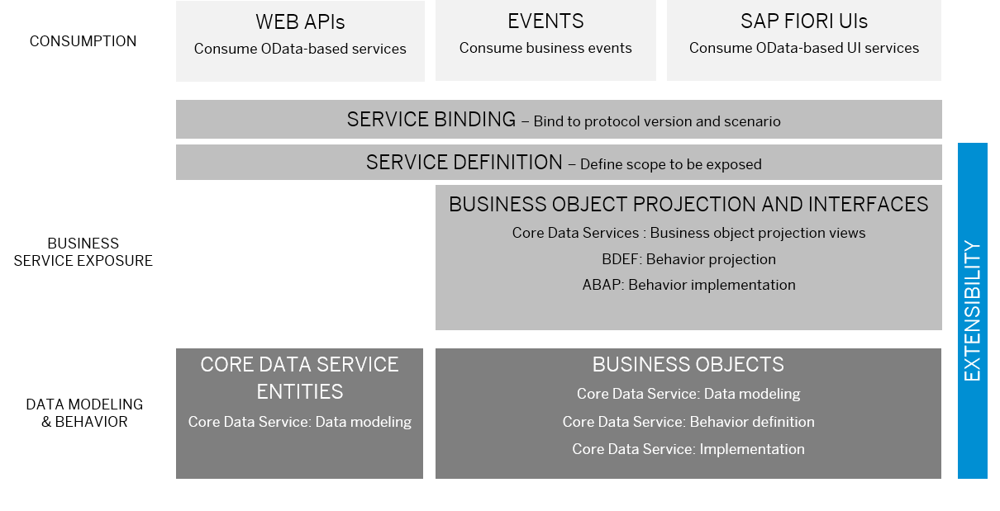

<!-- loio373046e38c214cc38ec7d65f54783dde -->

# Develop a Transactional Application

Transactional applications in ABAP Cloud provide a robust and scalable solution for managing business processes and data. The ABAP RESTful Application Programming Model \(RAP\) defines how transactional applications are built. The following graphic shows the big picture:

To build a transactional application, you define data models and implement business logic using a declarative approach. The data models as well as the behavior definition make up the ABAP RESTful Application Programming Model business object \(RAP BO\). The data model implemented with ABAP Core Data Services defines the structure of the data. The behavior definition is implemented with ABAP and the Entity Manipulation Language.

<a name="loio373046e38c214cc38ec7d65f54783dde__section_dkl_kbl_zyb"/>

## Develop Behavior

With RAP, the standard create, update, and delete operations must only be specified in the behavior definition to obtain a ready-to-run business object. In addition, the provisioning and handling of the transactional buffer is automatically done for you. The technical implementation aspects are taken over by the managed RAP BO provider. The interaction phase and the save sequence are implemented generically. For more information, see [Business Object Implementation Types](https://help.sap.com/docs/abap-cloud/abap-rap/business-object-implementation-types?version=abap_cross_product).

The application developer can then focus on business logic that is implemented using actions, validations, determinations, and user interaction. To define which consumers are allowed to read or change data of a business object, RAP offers an authorization concept to restrict access to the business object.

-   Actions

    You can use actions to develop custom modify operations to set a specific field value, for examples. See [Operations](https://help.sap.com/docs/abap-cloud/abap-rap/operations?version=abap_cross_product).

-   Validations

    To define which consumers are allowed to read or change data of a business object. To check your data for consistency and against certain conditions based on business or process requirements, you can implement validations. A validation is implicitly invoked by the business object’s framework if a trigger condition of the validation is fulfilled. See [Validations](https://help.sap.com/docs/abap-cloud/abap-rap/validations?version=abap_cross_product).

-   Determinations

    To trigger modify operations based on trigger conditions, for example when another field is changed, you can implement determinations. A determination is implicitly invoked by the business object’s framework if the trigger condition of the determination is fulfilled. See [Determinations](https://help.sap.com/docs/abap-cloud/abap-rap/determinations?version=abap_cross_product).

<a name="loio373046e38c214cc38ec7d65f54783dde__section_fxc_53l_zyb"/>

## Develop Authorization Control

You can define authorization checks for update operations like creates or custom operations like actions for a business object on global and instance level. For more information, see [Authorization Control](https://help.sap.com/docs/abap-cloud/abap-rap/authorization-control?version=abap_cross_product).

If your service is to be consumed by other applications, you can define a privileged mode to allow consumers to circumvent authorization checks. For this, the consumer must implement the respective checks in their authorization control implementation. For more information, see [RAP – with privileged mode](https://help.sap.com/doc/abapdocu_cp_index_htm/CLOUD/en-US/index.htm?file=abenbdl_privileged_mode.htm).

<a name="loio373046e38c214cc38ec7d65f54783dde__section_xzf_cdl_zyb"/>

## Develop Concurrency Control

Concurrency control prevents concurrent and interfering database access of different users. This ensures that data can only be changed if data consistency is assured. In RAP, you can either implement optimistic or pessimistic concurrency control:

-   Optimistic concurrency control relies on the concept that every change on a data set is logged by a specified ETag field. Most often, the ETag field contains a timestamp, a hash value, or any other versioning that precisely identifies the version of the data set. Optimistic concurrency control is only relevant when consuming business objects via OData. See[Optimistic Currency Control](https://help.sap.com/docs/abap-cloud/abap-rap/optimistic-concurrency-control?version=abap_cross_product).

-   Pessimistic concurrency control is done by exclusively locking data sets. The data set that is being modified by one user cannot be changed by another user at the same time. Technically, locking is ensured by using enqueue locks and global lock table entries. See [Pessimistic Concurrency Control \(Locking\)](https://help.sap.com/docs/abap-cloud/abap-rap/pessimistic-concurrency-control-locking?version=abap_cross_product).

<a name="loio373046e38c214cc38ec7d65f54783dde__section_whk_ncv_1zb"/>

## Develop User Interfaces

UIs create an intuitive and user-friendly interface for users to interact with the business processes. In ABAP Cloud, SAP Fiori ensures a consistent user experience when developing UIs. SAP Fiori applications can be developed for OData services that are exposed as UI services. SAP Fiori applications, following the SAP Fiori design principles, can be built using a combination of SAPUI5 and SAP Fiori elements. For more information on SAP Fiori elements and SAPUI5, see [Developing Apps with SAP Fiori Elements](https://sapui5.hana.ondemand.com/#/topic/03265b0408e2432c9571d6b3feb6b1fd) and [SAPUI5](https://help.sap.com/docs/SAPUI5?version=External).

While SAPUI5 is a development framework that allows you to build freestyle front-end applications, SAP Fiori elements is a framework that includes commonly used floor plan templates.

SAP Fiori elements applications are generated based on domain-specific annotations that define the layout, data binding, and behavior of a UI. You can define the overall layout for standard floor plans, define labels, implement value helps or define navigation on the UI to just name a few examples. The rendering of the UI is then handled by SAP Fiori elements, which interprets the annotations to create the final user interface.

Back-end features that are closely related to the UI like draft, feature control, and side effects:

-   Draft

    Applications with draft capabilities let users save their changes in the system and resume their work later, even on a different device, or after an unplanned shutdown. We recommend that you use a draft for your UI use cases to improve the user experience. RAP business objects need to be draft-enabled. See [Draft](https://help.sap.com/docs/abap-cloud/abap-rap/draft?version=abap_cross_product).

-   Feature Control

    You can provide information on how data should be displayed for consumption in an SAP Fiori UI, for example, if fields are mandatory or read-only. See [Feature Control](https://help.sap.com/docs/abap-cloud/abap-rap/feature-control?version=abap_cross_product).

-   Side Effects

    You can make a SAP Fiori elements UI aware that data changes of defined fields require the recalculation of other data values, permissions, or messages on the UI in case of UI scenarios based on draft-enabled RAP business objects. See [Side Effects](https://help.sap.com/docs/abap-cloud/abap-rap/side-effects?version=abap_cross_product).

For more information about UI development, see:

-   [SAP BTP, ABAP Environment UI Development](https://help.sap.com/docs/sap-btp-abap-environment/abap-environment/ui-development-overview)

-   [SAP Fiori Element Feature Showcase Application for the ABAP RESTful Application Programming Model](https://github.com/SAP-samples/abap-platform-fiori-feature-showcase)

<a name="loio373046e38c214cc38ec7d65f54783dde__section_frj_4cr_zyb"/>

## Develop Events or Include Reuse Services

With RAP, you can implement asynchronous process integration using remote or local events. Events allow you to implement a publisher – subscriber pattern with different consumers. Reuse services offer general capabilities that are required by multiple services, applications, and business areas. You can choose from a variety of reuse services that are ready-to-run, ranging from applications jobs over logging, forms, and emails up to change documents or the workflow.

For more information, see [Business Events for Process Integration](https://help.sap.com/docs/btp/sap-abap-restful-application-programming-model/creating-rap-business-events?version=Cloud).

<a name="loio373046e38c214cc38ec7d65f54783dde__section_zrq_vll_zyb"/>

## Define or Develop Extensions for a RAP Business Object

RAP offers the possibility to develop semantically rich, upgrade-safe, and lifecycle-stable extensions for business objects. An original business object developed by an extensibility-enabler is extended with additional functionality to extend the functional scope of the original RAP business object. Using well-defined extension points enabled in the original business object, an extension provider can then extend the original data model and behavior in accordance with the business requirements or create their own business service based on an RAP business object interface.

****

<table>
<tr>
<th valign="top">

Extensibility Use Case

</th>
<th valign="top">

Extensibility Persona

</th>
<th valign="top">

More Information

</th>
</tr>
<tr>
<td valign="top" rowspan="2">

Data Model Extension

Build full-stack data model extensions by adding new fields and associations including corresponding behavior characteristics and authorization control.

</td>
<td valign="top">

Extensibility-Enabler

Adds annotations and extension include structures to the original RAP business object to enable data model extensions.

</td>
<td valign="top">

-   For more information about enabling full-stack data extensibility, see [Extensibility-Enablement for CDS Data Model Extensions](https://help.sap.com/docs/abap-cloud/abap-rap/extensibility-enablement-for-cds-data-model-extensions?version=abap_cross_product).

-   For an implementation example, see [Enabling Data Model Extensions](https://help.sap.com/docs/abap-cloud/abap-rap/enabling-data-model-extensions?version=abap_cross_product).

</td>
</tr>
<tr>
<td valign="top">

Extension Provider

Extends the original RAP business object with new fields or associations including field characteristics depending on the options defined by the extensibility-enabler.

</td>
<td valign="top">

-   For more information about how to develop data model extensions, see [CDS Data Model Extensions](https://help.sap.com/docs/abap-cloud/abap-rap/cds-data-model-extensions?version=abap_cross_product).

-   For an implementation example, see [Develop Data Model Extensions](https://help.sap.com/docs/abap-cloud/abap-rap/develop-data-model-extensions?state=DRAFT&version=abap_cross_product).

</td>
</tr>
<tr>
<td valign="top" rowspan="2">

Behavior and Field-Related Behavior Extensions

Build additional behavior like new validations, determinations, or actions including dynamic feature control and other field-related behavior.

</td>
<td valign="top">

Extensibility-Enabler

Enables data model extensibility and behavior extensibility on the original RAP business object.

</td>
<td valign="top">

-   For more information about enabling your business object for behavior extensions, see [Extensibility-Enablement for Behavior Extensions](https://help.sap.com/docs/abap-cloud/abap-rap/extensibility-enablement-for-behavior-extensions?version=abap_cross_product).

-   For an implementation example, see:

    -   [Enabling Non-Standard Behavior and Field-Related Behavior](https://help.sap.com/docs/abap-cloud/abap-rap/enabling-non-standard-behavior-and-field-related-behavior?version=abap_cross_product)

    -   [Enabling Standard Behavior Extensions](https://help.sap.com/docs/abap-cloud/abap-rap/enabling-standard-behavior-extensions?version=abap_cross_product)

</td>
</tr>
<tr>
<td valign="top">

Extension Provider

Extends the original RAP business object with new validations, determinations, or actions depending on the options defined by the extensibility-enabler.

</td>
<td valign="top">

-   For more information about how to develop different behavior extensions, see [Behavior Extensions](https://help.sap.com/docs/abap-cloud/abap-rap/behavior-extensions?version=abap_cross_product).

-   For an implementation example, see [Develop Behavior Extensions](https://help.sap.com/docs/abap-cloud/abap-rap/develop-behavior-extensions?version=abap_cross_product).

</td>
</tr>
<tr>
<td valign="top" rowspan="2">

Node Extensibility

Build additional business object nodes with own behavior and data model with node extensibility.

</td>
<td valign="top">

Extensibility-Enabler

Enables node extensibility on the original RAP business object.

</td>
<td valign="top">

-   For more information about node extensibility enabling, see [Extensibility-Enablement for Node Extensibility](https://help.sap.com/docs/abap-cloud/abap-rap/extensibility-enablement-for-node-extensibility?version=abap_cross_product).

-   For an implementation example, see [Enabling Node Extensions](https://help.sap.com/docs/abap-cloud/abap-rap/enabling-node-extensions?version=abap_cross_product).

</td>
</tr>
<tr>
<td valign="top">

Extension Provider

Extend the original business object with new nodes that have their own data model and behavior.

</td>
<td valign="top">

For more information about how to develop node extension, see [Node Extensions](https://help.sap.com/docs/abap-cloud/abap-rap/node-extensions?version=abap_cross_product).

</td>
</tr>
</table>

<a name="loio373046e38c214cc38ec7d65f54783dde__section_bby_kdr_zyb"/>

## Develop Tests

### Develop Unit Test for the Transactional Services

You can use the CDS test double framework to implement unit tests for the data model of transactional Services. With the RAP business object test double framework, you can manage the dependencies in the RAP business object behavior implementation and develop unit tests for RAP business object behavior like actions or determinations.

For an example, see:

-   [Developing Unit Tests for a CDS View](https://help.sap.com/docs/abap-cloud/abap-rap/developing-unit-tests-for-cds-view?version=abap_cross_product)

-   [Developing Unit Tests for a Behavior Implementation](https://help.sap.com/docs/abap-cloud/abap-rap/developing-unit-tests-for-behavior-implementation?version=abap_cross_product)

### Develop Integration Tests for Transactional Services

With the OData Client Proxy and the RAP business object TDF, you can implement integration tests to test use cases via EML and OData, where multiple functional units are involved. Reading or creating instances from outside, for example, makes use of the whole RAP application and involves dependent operations, such as determinations and validations. The Integration tests validate whether the interaction between the involved functional units works as expected.

For an example, see:

-   [EML Integration Tests](https://help.sap.com/docs/abap-cloud/abap-rap/eml-integration-tests?version=abap_cross_product)

-   [OData Integration Tests](https://help.sap.com/docs/abap-cloud/abap-rap/odata-integration-tests?version=abap_cross_product)

For more information about the OData Client Proxy, see [OData Client Proxy-Consumption Types](https://help.sap.com/docs/btp/sap-business-technology-platform/client-proxy-instance-types?version=Cloud#consumption-types).

