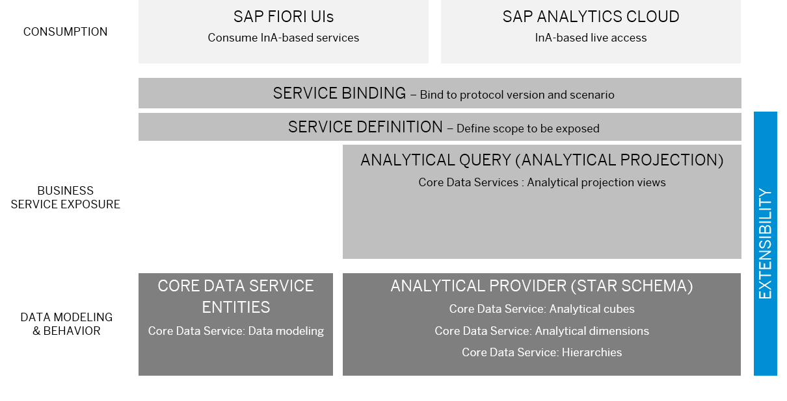

<!-- loiob845c859efae4e319b9c95e10c250efe -->

# Develop an Analytical Application

Embedded analytics allows you to build complex analytical data models to evaluate and analyze business data in your ABAP system. In embedded analytics, the ABAP analytical engine is part of the software stack and operates on the same data persistence as the transactional applications. The analytical queries operate directly on the business data without data replication to an external data warehouse system. Instead, the real-time business data is queried to always evaluate the most recent changes and trends in your business data.

Analytical applications require a multidimensional data model that focuses on a minimal join depth and a semantically rich data model that is easy to understand. You can build multidimensional data models with:

-   **Dimensions** with master-data like information to provide the context for an analytical report. A typical example for a dimension is time or location information.

-   **Hierarchies** that allow you to navigate different data granularity levels in the different dimensions. An example for navigation a time dimensions would be a drill-down from year – to quarter – to month or vice versa.

-   **Cubes** that represent the multidimensional data model, consisting of different dimensions and measures.

-   **Analytical queries** that define the initial report layout that is displayed, select the initial data, and can calculate measures that weren’t included in the underlying cube.

<a name="loiob845c859efae4e319b9c95e10c250efe__section_gds_ybs_zyb"/>

## Calculate Measures and KPIs

Calculating KPIs for forecasts or decision-making is an integral task for analytical reports. To calculate numeric fields like measures or KPIs you can aggregate data based on different rule sets, like, for example, sum or average. In ABAP Cloud, the standard aggregation behavior is summation \(SUM\), minimum \(MIN\), and maximum \(MAX\).

These standard aggregations can be further refined on query level with calculated measures. To define additional calculations and queries for additional KPIs. With restricted measures, you can exclude certain values from the aggregation. This enables you to filter the measure result set based on conditions of your choice.

For more information, see:

-   [Standard Aggregations](https://help.sap.com/docs/abap-cloud/abap-analytics/standard-aggregations?version=abap_cross_product) 

-   [Calculated Measures](https://help.sap.com/docs/abap-cloud/abap-analytics/calculated-measures?version=abap_cross_product) 

-   [Restricted Measures](https://help.sap.com/docs/abap-cloud/abap-analytics/restricted-measures?version=abap_cross_product) 

<a name="loiob845c859efae4e319b9c95e10c250efe__section_gj5_vcs_zyb"/>

## Define or Develop Extensions for Analytical Applications

In an analytical data model, each part of the data model can be extended individually using predefined extension points in the original analytical data model. As extensibility-enabler, you can make your own analytical data models extensible. All parts of the analytical provider can be extended. You can, for example, add new dimensions to a cube to enhance the reporting depth or you can add additional hierarchies to enable additional navigation throughout the data set. The following graphics show you where analytical data models can be enabled for extensibility.

****

<table>
<tr>
<th valign="top">

Extensibility Use Case

</th>
<th valign="top">

Extensibility Tasks

</th>
</tr>
<tr>
<td valign="top" rowspan="2">

Dimension Extension

Add new hierarchies to a dimension or add new fields or associations to the dimension to diversify the data model.

</td>
<td valign="top">

Extensibility-Enabler

Add annotations and extension include structures to the original dimension to enable data model extensions like fields or associations.

</td>
</tr>
<tr>
<td valign="top">

Extension Provider

-   Add new hierarchy

    To extend a dimension with a new hierarchy, create a new hierarchy and add it as an association to the corresponding dimension.

-   Add new field extension

    Extend the original dimension with additional fields.

</td>
</tr>
<tr>
<td valign="top" rowspan="2">

Cube Extension

Add new dimensions to a cube to extend the scope of the data analysis or add new measures to the cube to calculate additional values.

</td>
<td valign="top">

Extensibility-Enabler

Add annotations and extension include structures to the original data model to enable data model extensions, like fields or additional dimensions.

</td>
</tr>
<tr>
<td valign="top">

Extension Provider

-   Add new dimension

    To extend a cube with a new extension, create a new dimension, or use a predelivered SAP dimension and add it as an association to the corresponding dimension.

-   Add new field \(measure\)

    Extend the original cube with additional measures for new calculations.

</td>
</tr>
<tr>
<td valign="top" rowspan="2">

Analytical Query Extensions

Add new numeric fields to the query to extend the scope of the data analysis.

</td>
<td valign="top">

Extensibility-Enabler

Add annotations and extension include structures to the original data model to enable data model extensions, like additional numeric fields for calculations in queries.

</td>
</tr>
<tr>
<td valign="top">

Extension Provider

Add new fields to extend the scope of the data analysis.

</td>
</tr>
<tr>
<td valign="top" rowspan="2">

Service Definition Extension

Create a new UI based on a released query or extend the service definition to add new queries to a service definition.

</td>
<td valign="top">

Extensibility-Enabler

Enable the service definition for extensibility to add additional queries to a service.

</td>
</tr>
<tr>
<td valign="top">

Extension Provider

-   Create a custom UI based on a released UI to adapt the UI to your business requirements.

-   Add a new query to a service definition to extend the original service definition with additional queries.

</td>
</tr>
</table>

<a name="loiob845c859efae4e319b9c95e10c250efe__section_ahv_bkt_zyb"/>

## Develop Unit Test for the Analytical Applications

You can use the CDS test double framework to implement unit tests for the multidimensional data model and the standard aggregations. For the analytical query, manual tests ensure that all additional calculations and measures work as expected.

For an example, see [Developing Unit Tests for a CDS View](https://help.sap.com/docs/abap-cloud/abap-rap/developing-unit-tests-for-cds-view?version=abap_cross_product).

<a name="loiob845c859efae4e319b9c95e10c250efe__section_l4s_nkt_zyb"/>

## Develop UIs for Analytical Applications

Analytical services use the Analytics Details annotations to specify the analytical query layout and to specific aggregation and planning behavior of the data.

With the annotation `@AnalyticsDetails.query.axis:'<VALUE>’`, you can position the elements of a query on the different axis to define the basic layout for the report.

For more information, see [AnalyticsDetails Annotations](https://help.sap.com/docs/abap-cloud/abap-rap/analyticsdetails-annotation?version=abap_cross_product).

