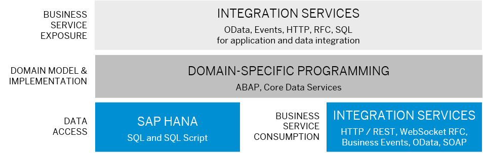

<!-- loioc079f335539a422990c4728cf4045fed -->

# Develop an Integration Service

Integration services allow you to create connections to other systems using different protocols. This enables seamless communication and data exchange between services and applications, as well as the ability to build end-to-end business processes across system boundaries. ABAP Cloud supports integration with various integration partners such as SAP cloud products, SAP BTP services, customer extensions, and external services.

There are SAP-managed integration scenarios for out-of-the-box integration, for example, to integrate the SAP BTP, ABAP environment with other SAP products like SAP S/4HANA Cloud, public edition. In addition, you can expose and consume custom integration services to implement your own integration use cases. For an overview of SAP-managed integration scenarios, see [Overview of Communication Scenarios Managed by SAP](https://help.sap.com/docs/sap-btp-abap-environment/abap-environment/overview-of-communication-scenarios-managed-by-sap).

The following sections focus on exposing and consuming custom integration services and event-based integration for process and data integration.

<a name="loioc079f335539a422990c4728cf4045fed__section_erc_dpx_zyb"/>

## Process and Data Integration

ABAP Cloud offers various possibilities to integrate with other systems using the OData, SOAP, HTTP, RFC, and SQL protocols. In addition, you can use the SAP Event Mesh to expose and consume business events:

-   Integration Services Exposure: The development model for exposing integration services depends on the respective protocol. OData, SQL, and business events interfaces can be created using the RAP programming model. The domain-specific logic of SOAP, HTTP, and RFC services is implemented with ABAP.

-   Integration Service Consumption: The consumption of services and events from other systems is simplified by using metadata to generate an Event Consumption Model or a Service Consumption Model. Service Consumption Models are available for OData, SOAP, RFC, and business events. For HTTP and RFC, you can define the consumption requests directly in ABAP.

ABAP Cloud supports two main integration use cases:

-   Data Integration

    Addresses the data exchange between two or more communication partners without a relation to a business process. One of the main use cases for data integration is cross-system analytics. In data integration scenarios, the raw data is exchanged without leveraging the domain-specific logic.

-   Process Integration

    Structures the communication on app or service level along a predefined business process, for example, order-to-cash. For process integration, the implemented domain-specific logic for a service is considered. The communication between the communication partners for point-to-point integration is bidirectional, meaning that information is exchanged in both directions. There are both synchronous and asynchronous process integration patterns, for example, event-based integration follows an asynchronous approach.

ABAP Cloud offers several different protocols for integrations such as OData, SOAP, Remote Function Calls \(RFCs\), HTTP, SQL, and business events for asynchronous integration. This ensures compatibility between SAP products or third-party services which usually expose a functionality only via a dedicated protocol. The different protocols have different advantages depending on your use case. For example, business events for asynchronous communication require a dedicated integration pattern.

For more information, see:

-   Develop Integration Services

-   Decide on Integration Use Case: a use case overview

-   Choose and Integration Protocol and Communication Pattern: a protocol and communication pattern overview

<a name="loioc079f335539a422990c4728cf4045fed__section_flw_tpx_zyb"/>

## Expose Integration Services

ABAP Cloud enables the exposure of business services to other systems via inbound communication. To make an integration service externally available, you must:

-   Develop an integration service for process or data integration

    Create an integration service to process the incoming request and to create the response for the communication partner.

-   Set up communication management

    Prepare administrative setup for the administrator by creating, for example, a communication scenario.

<a name="loioc079f335539a422990c4728cf4045fed__section_jjk_ypx_zyb"/>

## Develop Integration Services for Process Integration

ABAP Cloud supports various protocols like HTTP, remote function calls or services published via service bindings, such as OData for process integration.

<a name="loioc079f335539a422990c4728cf4045fed__section_udg_1qx_zyb"/>

## Develop OData Web APIs

An OData API is an OData service whose metadata doesn't entail any UI-specific annotations that are defined for the data model. An OData API facilitates the exchange of business information between an application and any client. OData APIs are defined with the ABAP RESTful Application Programming Model.

For more information, see [Develop Web APIs](https://help.sap.com/docs/abap-cloud/abap-rap/develop-web-apis?version=abap_cross_product).

<a name="loioc079f335539a422990c4728cf4045fed__section_x22_cqx_zyb"/>

## Develop HTTP Services

You can develop an HTTP service by creating an HTTP service object. The required handler class to handle the HTTP request is automatically created with the HTTP service object. The interface IF\_HTTP\_SERVICE\_EXTENSION with HTTP request/response parameters, enables you to build an HTTP service with full flexibility.

For more information, see:

-   [HTTP Service Development](https://help.sap.com/docs/sap-btp-abap-environment/abap-environment/http-service-development)

-   [Working with the HTTP Service Editor \(ABAP Development Tools: User Guide\)](https://help.sap.com/docs/btp/sap-abap-development-user-guide/working-with-http-service-editor?version=Cloud)

<a name="loioc079f335539a422990c4728cf4045fed__section_bg2_fqx_zyb"/>

## Develop RFC Services

You can create an RFC service based on a remote-enabled functions module. You've full flexibility regarding the implementation details.

For more information, see [RFC - Inbound Communication](https://help.sap.com/docs/sap-btp-abap-environment/abap-environment/inbound-communication-rfc).

<a name="loioc079f335539a422990c4728cf4045fed__section_esy_lqx_zyb"/>

## Develop SQL Services for Data Integration

You can access CDS view entities in an ABAP system using SQL and the open database connectivity \(ODBC\), a standard API for accessing databases. As a result, you can use SQL statements in external analytical tools to access data in database tables that reside in an ABAP system.

For an example, see:

-   [Developing and Exposing an SQL Service in the ABAP System](https://help.sap.com/docs/sap-btp-abap-environment/abap-environment/developing-and-exposing-sql-service-in-abap-system) 

-   [Exposing the SQL Service for Privileged Access](https://help.sap.com/docs/sap-btp-abap-environment/abap-environment/exposing-sql-service-for-privileged-access) 

-   [Exposing the SQL Service for Business User Access](https://help.sap.com/docs/sap-btp-abap-environment/abap-environment/exposing-sql-service-for-business-user-access) 

<a name="loioc079f335539a422990c4728cf4045fed__section_rvb_4qx_zyb"/>

## Setting up the Communication Management for Inbound Communication

You have to create a communication scenario with inbound services for the exposed endpoints of the communication partner. This enables the administrator of the system to set up the integration, for example, by creating credentials for the authentication of the communication partner and assigning corresponding authorizations to the communication user in the Communication Management applications.

For more information, see [Consuming Services in the Context of API with Communication Users \(Inbound\)](https://help.sap.com/docs/btp/sap-abap-development-user-guide/consuming-services-in-ui?version=Cloud).

<a name="loioc079f335539a422990c4728cf4045fed__section_bjp_mrx_zyb"/>

## Consume Integration Services

Not all data that is consumed in ABAP Cloud is read from the SAP HANA database. Instead, data can be consumed using outbound communication via many protocols from remote integration partners, both from cloud services and from the on-premise landscape. For outbound communication, you must:

-   Implement the business service consumption

    Create a proxy class to create the request and process the response by the communication partner.

-   Set up the communication management

    Prepare integration setup for the administrator by creating, for example, a communication scenario.

<a name="loioc079f335539a422990c4728cf4045fed__section_yqt_ytz_zyb"/>

## Consume Services for Process Integration

To simplify the implementation of a remote call, you can create a service consumption model for the external service. The service consumption model creates proxies for the remote service. That way, you can access the service in a strictly typed manner without the need to compile requests and parse responses.

<a name="loioc079f335539a422990c4728cf4045fed__section_bxv_ztz_zyb"/>

## Consume OData Services

The OData client proxy is the interface between the client \(consumer of a service\) and the service implementation \(data provisioning\) in the OData service consumption in ABAP. The OData client proxy enables you to create an OData-typed proxy to run OData requests in your ABAP implementation.

For more information, see [OData Services](https://help.sap.com/docs/sap-btp-abap-environment/abap-environment/odata-services).

<a name="loioc079f335539a422990c4728cf4045fed__section_o5m_45z_zyb"/>

## Consume HTTP Services

You can implement free-style integrations without generated proxies via the HTTP client library.

For more information, see [Enable HTTP Communication in Your ABAP Code](https://help.sap.com/docs/sap-btp-abap-environment/abap-environment/enable-http-communication-in-your-abap-code).

<a name="loioc079f335539a422990c4728cf4045fed__section_q5y_w5z_zyb"/>

## Consume Remote Function Call Services

You can generate a typed-proxy for calling one or more remote-enabled function modules \(RFMs\) using a service consumption model or directly use the `CALL FUNCTION...DESTINATION` statement.

For more information, see:

-   [RFC](https://help.sap.com/docs/sap-btp-abap-environment/abap-environment/rfc) 

-   [Generating Proxies for Remote Function Call \(RFC\)](https://help.sap.com/docs/btp/sap-abap-development-user-guide/generating-proxies-for-remote-function-call-rfc?version=Cloud)

<a name="loioc079f335539a422990c4728cf4045fed__section_rny_2vz_zyb"/>

## Consume SOAP Services

You can generate a service consumption model that is based on a Web service description language \(WSDL\) file describing your service.

For more information, see [SOAP](https://help.sap.com/docs/sap-btp-abap-environment/abap-environment/soap).

<a name="loioc079f335539a422990c4728cf4045fed__section_rcd_jvz_zyb"/>

## Consume SQL Services for Data Integration

After installing the ODBC driver for ABAP, the SQL service and the ODBC driver can be used to provide data access from external ODBC-based clients.

For more information, see [Consumption of the SQL Service and the ODBC Driver for ABAP](https://help.sap.com/docs/sap-btp-abap-environment/abap-environment/consumption-of-sql-service-and-odbc-driver-for-abap).

<a name="loioc079f335539a422990c4728cf4045fed__section_q4j_qvz_zyb"/>

## Set Up Communication Management for Outbound Services

You've to create a communication scenario with outbound services for the endpoints of the communication partner. This enables the administrator of the system to set up the integration by maintaining the credentials for authentication at the communication partner in the Communication Management apps, see [Consuming Services in the Context of API with Communication Users \(Outbound\)](https://help.sap.com/docs/btp/sap-abap-development-user-guide/consuming-services-in-context-of-api-with-communication-users-outbound?version=Cloud).

ABAP Cloud supports complex scenarios, where the relevant integration partner is determined at runtime \(receiver determination\). In these cases, the communication scenario can be set up multiple times in each tenant by the administrator.

<a name="loioc079f335539a422990c4728cf4045fed__section_ypr_5vz_zyb"/>

## Develop Event-Based Integration

Event-driven architecture enables asynchronous communication between an event provider and an event consumer in use cases where no direct response from the event consumer is required. Events represent a significant change of state that is relevant for follow-up processes, for example, if a new travel is created and you want to enable consuming applications to trigger additional workflows.

This chapter focuses on remote business events. Local business events are based on the same design time but are consumed using an event handler class that is set up as a class pool, similar to a behavior pool. For more information about consuming local events, see [Local Consumption](https://help.sap.com/docs/abap-cloud/abap-rap/business-event-consumption?version=abap_cross_product).

<a name="loioc079f335539a422990c4728cf4045fed__section_hdh_yvz_zyb"/>

## Expose Business Events

The development of business events is natively integrated with the ABAP RESTful Application Programming Model. An event, that is defined in an RAP behavior definition, can be exposed to remote consumers by assigning an event binding. The event binding defines the topic of the event.

The administrator can connect the system to an SAP Event Mesh instance and expose this event topic in the Maintain Event Channel Binding application. Potential integration partners can then consume this event topic from the Event Mesh.

For more information, see:

-   [Business Events](https://help.sap.com/docs/abap-cloud/abap-rap/business-events?version=abap_cross_product) 

-   [Develop Business Events](https://help.sap.com/docs/abap-cloud/abap-rap/develop-business-events?version=abap_cross_product) 

-   [Checking Channel Binding](https://help.sap.com/docs/sap-btp-abap-environment/abap-environment/checking-channel-binding) 

<a name="loioc079f335539a422990c4728cf4045fed__section_jpb_fxz_zyb"/>

## Extend Business Events

You can customize the payload of an event with derived events. A derived event is defined with reference to an already implemented event and allows the definition of a payload that deviates from one of the referenced business events. When the referenced event is raised, the derived event is raised as well, and the custom payload is applied. For more information, see [Derived Business Events](https://help.sap.com/docs/abap-cloud/abap-rap/derived-business-events).

<a name="loioc079f335539a422990c4728cf4045fed__section_opr_kxz_zyb"/>

## Consume Business Events

To consume events from other systems remotely, you can generate an Event Consumption Model based on the AsyncAPI metadata of the event. The Event Consumption Model generates a typed handler class to process the event.

To simplify the tasks of the administrator, multiple Event Consumption Models can be bundled into a communication scenario. The administrator can then create a communication arrangement to link a channel to an SAP Event Mesh with a communication scenario so that the list of event types is processed by a communication user.

For more information, see:

-   [Business Event Consumption](https://help.sap.com/docs/abap-cloud/abap-rap/business-event-consumption?version=abap_cross_product)

-   [Generating an Event Consumption Model](https://help.sap.com/docs/btp/sap-abap-development-user-guide/generating-event-consumption-model?version=Cloud)

