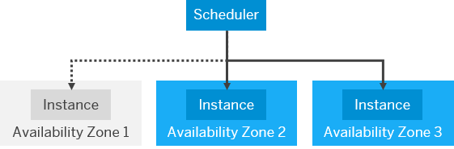

<!-- loiob1b929a5aea64571b2f74e810b622568 -->

# Developing Resilient Applications

Our best practices about resilient application design help you to make your applications running on SAP BTP stable and highly available.

There are many different principles and patterns you can use to make your software resilient. However, it isn't always easy to find the combination that best fits your applications. For an overview of the various options you have when developing applications and detailed information about the individual patterns you can use, as well as examples for applied resilience principles and how to develop your own resilient apps on SAP BTP, read [Developing Resilient Apps on SAP BTP](https://help.sap.com/viewer/eadaa45871804b4a974be865f627e791/Cloud/en-US/d1fe5fd8ecfb46c193221ebb991af3d7.html).

For examples on how to use selected SAP BTP services in a multi-region setup, see [Route Multi-Region Traffic to SAP BTP Services Intelligently](https://github.com/SAP-samples/btp-services-intelligent-routing).

You can also use the [Architecting Multi-Region Resiliency for SAP BTP Use Cases](https://discovery-center.cloud.sap/refArchDetail/ref-arch-multi-region-ha) reference architecture in the SAP Discovery Center. It shows the multi-region high availability architecture for SAP BTP services and the applications built on SAP BTP.

<a name="loiob1b929a5aea64571b2f74e810b622568__section_developaz"/>

## Developing Resilient Applications in Cloud Foundry

In SAP BTP, Cloud Foundry environment, you can use the availability zones \(AZ\): Benefit from the high availability mechanisms in Cloud Foundry by setting up your applications with multiple instances. You do not have to do anything explicitly to distribute the instances across the different AZs - this is handled by the platform. For more information, see [Availability Zones in the Cloud Foundry Environment](https://help.sap.com/viewer/65de2977205c403bbc107264b8eccf4b/Cloud/en-US/b6a7e11c3a58416a9ab1175bba17193a.html "The Cloud Foundry environment follows the recommendations of our partner IaaS providers by leveraging the availability zones (AZ) concept.") :arrow_upper_right:.

Setting up your application with multiple instances might have an impact on your applications' capability for handling requests: In case of an AZ failure in a 3-AZ-deployment, at least one third of the application instances are affected and unavailable until Cloud Foundry can reschedule these instances on a healthy virtual machine.

During that period, the remaining instances in the healthy AZs have to carry the request load.

  
  
**Distribution During an Availability Zone Failure**

<a name="loiob1b929a5aea64571b2f74e810b622568__section_ojk_v3n_jcc"/>

## Developing Resilient Applications in Kyma

Learn how to develop stable Kubernetes and microservice-based applications, as well as Istio-related resiliency tips with [Develop Resilient Applications in the Kyma Runtime](https://help.sap.com/viewer/65de2977205c403bbc107264b8eccf4b/Cloud/en-US/7c9496c88a294b7f9ccc69a7e0998817.html "All SAP BTP, Kyma runtime production plans ensure high availability. To benefit from the high-availability setup, make sure the architecture and deployment of your application comply with resiliency best practices. Use the following guidelines for Kubernetes and microservice-based applications to develop a stable application. Read further to find some Istio-related resiliency tips.") :arrow_upper_right:.

**Related Information**  

[Resilience, High Availability, and Disaster Recovery \(Cloud Foundry, ABAP and Kyma Environments\)](https://help.sap.com/docs/btp/sap-business-technology-platform/resilience-high-availability-and-disaster-recovery?locale=en-US&version=Cloud#loioe3ac4f7c25a3442ca585950095eec599)

