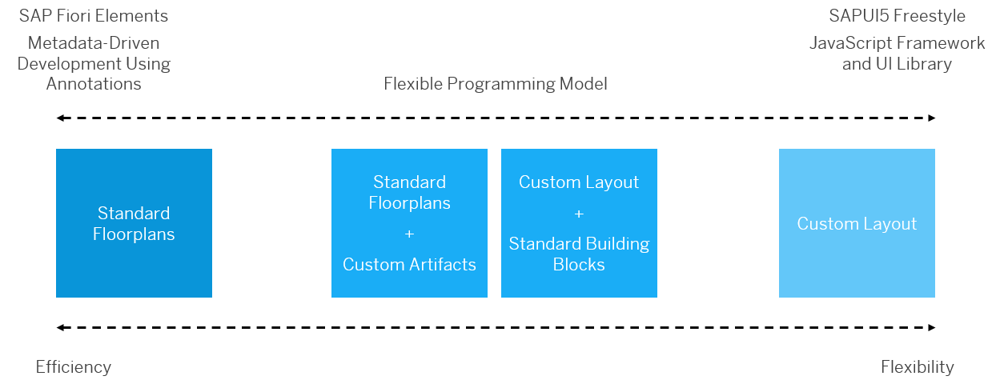

<!-- loio9f1d42ec74e7438db9771a3176ccb7ff -->

# Develop the User Interface

There are three approaches to develop the UI using SAP Fiori:

-   Freestyle SAPUI5

-   SAPUI5 with SAP Fiori elements

-   Freestyle SAPUI5 with flexible programming model

<a name="loio9f1d42ec74e7438db9771a3176ccb7ff__section_mf3_sl5_lxb"/>

## Freestyle SAPUI5

This is the standard, pure SAPUI5 framework that you can use to freely develop your application user interface as you wish. If your development team has experienced web developers and would want to implement a custom UI layout for your application, using SAPUI5 freestyle you have complete flexibility about how the application can look and perform. You can also specify the layout, flow, menu structure, interaction patterns, and so on. To develop SAPUI5 applications freestyle, you can start with the [Basic template](https://help.sap.com/docs/SAP_FIORI_tools/17d50220bcd848aa854c9c182d65b699/14fdcc0a9d834090a07435cfef962b01.html) in SAP Business Application Studio.

See [Developing Apps](https://ui5.sap.com/#/topic/23cfd955f58142389fa7c9097e11559c).

<a name="loio9f1d42ec74e7438db9771a3176ccb7ff__section_g4s_445_lxb"/>

## SAPUI5 with SAP Fiori Elements

SAP Fiori elements is a UI library that uses SAPUI5 as its foundation. Its purpose is to scale application development and maintenance by providing substantial standard functionality out of the box, for example, editing business objects. It also relieves you from some tasks in the area of non-functional requirements such as accessibility, performance optimization etc. SAP Fiori elements provides [several standard templates](https://ui5.sap.com//#/topic/797c3239b2a9491fa137e4998fd76aa7) that determine the overall layout and behavior of an SAP Fiori application. SAP Fiori elements relies on OData metadata annotations to define what information is displayed within the floorplan of the application that is generated. The templates allow you to create SAP Fiori applications that follow the SAP Fiori design standards. While SAP Fiori elements supports both OData Version 4 and OData Version 2, we recommend that you use SAP Fiori elements floorplans for OData V4. It comes with an ISO certification and provides innovations like the [flexible programming model](https://ui5.sap.com/test-resources/sap/fe/core/fpmExplorer/index.html#/overview/introduction) which makes it easier to create or [extend](https://ui5.sap.com/test-resources/sap/fe/core/fpmExplorer/index.html#/customElements/customElementsOverview) applications based on SAP Fiori elements for OData V4.

See [Developing Apps with SAP Fiori Elements](https://ui5.sap.com/#/topic/03265b0408e2432c9571d6b3feb6b1fd).

<a name="loio9f1d42ec74e7438db9771a3176ccb7ff__section_kr3_fp5_lxb"/>

## Freestyle SAPUI5 with Flexible Programming Model

This approach is a hybrid in-between pure SAPUI5 and SAP Fiori elements. You can start with the Custom Page template in SAP Business Application Studio. The Custom Page template allows you to combine freestyle SAPUI5 code with [building blocks](https://ui5.sap.com/test-resources/sap/fe/core/fpmExplorer/index.html#/buildingBlocks/buildingBlockOverview). For example, if you want a table that works with OData V4 annotations and automatically behaves like the ones in SAP Fiori elements floorplans, you can use the corresponding building block. The building blocks are provided by the flexible programming model to meet specific application requirements without needing any code to configure what they display.

<a name="loio9f1d42ec74e7438db9771a3176ccb7ff__section_x1g_n5y_zxb"/>

## When to Use What

To make the right decision out of these three options, it's important for you as an application developer to understand their features and limitations. The overall recommendation would be to use as much SAP Fiori elements as possible, as much SAPUI5 freestyle as needed.

### When UI Design Requirements Match SAP Fiori Elements Floorplans

If the current and foreseeable application UI design requirements comply with SAP Fiori elements patterns, then use the available standard SAP Fiori elements floorplans. The flexible programming model provides more options to use SAP Fiori elements by allowing to add custom artifacts to the application via extension points.

### When UI Design Requirements Don't Match Any SAP Fiori Elements Floorplans

-   You can flexibly implement a custom layout and content by combining SAPUI5 with building blocks from the flexible programming model.

-   If there's a benefit from using building blocks in a freestyle SAPUI5 application, there's an easy path to integrate the flexible programming model when needed by following the [three-step approach](https://ui5.sap.com/test-resources/sap/fe/core/fpmExplorer/index.html#/buildingBlocks/guidance/guidanceCustomApps). If OData V4 is used and relevant annotations are being maintained in the back end, then such a benefit probably exists:

