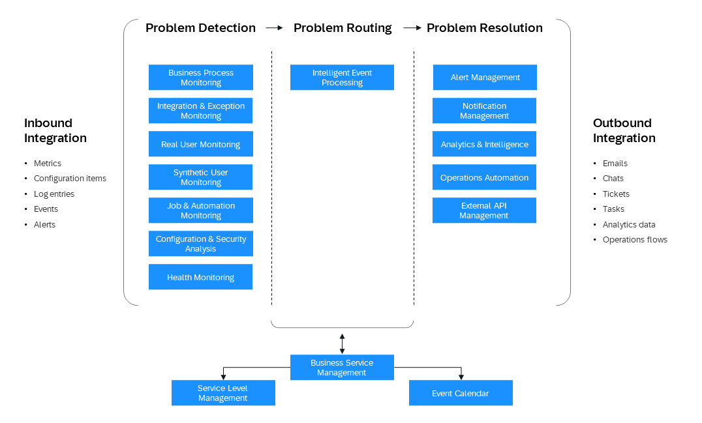

<!-- loio34065a44e2ef4907a7482221ce3383ec -->

# Establish End-to-End Observability

<a name="loio34065a44e2ef4907a7482221ce3383ec__section_pjx_r4y_chc"/>

## Introduction to Observability in SAP BTP

Observability in SAP Business Technology Platform \(SAP BTP\) empowers development and operations teams to proactively monitor, analyze, and optimize application performance using telemetry data - logs, metrics, and traces. It is structured into two complementary layers that together provide comprehensive visibility across your SAP landscape:

-   Central Observability, delivered via SAP Cloud ALM, offers a unified, strategic view across all SAP services and customer-built applications. It enables efficient issue detection through integrated monitoring, alerting, and business service management - helping teams maintain service reliability and performance.

-   Local Observability, enabled through tools such as SAP Cloud Logging, provides granular, technical insights into customer-built applications. It supports deep-dive analysis of runtime telemetry signals, facilitating rapid troubleshooting and performance optimization at the component level.

Both layers are interconnected through context-sensitive navigation and API integration, ensuring seamless transitions between high-level oversight and detailed diagnostics. Telemetry data—covering logs, metrics, and traces—flows from SAP BTP runtimes and services into these observability layers via OpenTelemetry-based instrumentation. This architecture reduces mean time to detect \(MTTD\) and mean time to resolve \(MTTR\), strengthening operational resilience and enabling faster, data-driven decision-making.

In addition, many SAP products provide embedded local monitoring capabilities for product-specific insights with minimal configuration. These capabilities are integrated into cross-navigation workflows from SAP Cloud ALM, allowing users to drill down from central dashboards into detailed product-level diagnostics for immediate action.

To complement these observability layers, the SAP Alert Notification service delivers real-time notifications for critical events across SAP BTP. It ensures that alerts generated in SAP solutions, central or local observability tools, can be routed to preferred communication channels - such as email, SMS, or third-party collaboration platforms - enabling proactive incident response and reducing operational risk.

SAP BTP spans Software-as-a-Service \(SaaS\) solutions like SAP S4/HANA, SAP HANA Cloud, SAP Analytics Cloud and more, and Platform-as-a-Service \(PaaS\) environments such as Cloud Foundry and Kyma. The BTP Observability capabilities integrate across these layers, ensuring consistent monitoring for both SAP-delivered and customer-built applications.

<a name="loio34065a44e2ef4907a7482221ce3383ec__section_y4v_1py_chc"/>

## OpenTelemetry in SAP BTP: Strategy and Customer Value

OpenTelemetry, the industry-standard for cloud-native observability, ensures consistent and scalable monitoring across distributed systems. It provides a unified set APIs, and SDKs to instrument applications and collect telemetry data - logs, metrics, and traces - across distributed systems. SAP has adopted OpenTelemetry to ensure consistent, scalable, and vendor-neutral observability across SAP-built and customer-developed applications on SAP BTP.

By integrating OpenTelemetry into SAP BTP runtimes, SAP enables customers to extend built-in observability with their own instrumentation. This allows them to expose custom telemetry data for the workloads they manage, supporting deeper insights into application behavior and performance.

SAP’s strategy centers on:

-   Standardized instrumentation: SAP and customer applications utilize the same OpenTelemetry-based Data Collection Libraries to provide telemetry signals consistently and openly.

-   Open API & integration: OpenTelemetry-compliant inbound APIs allow customers to connect non-SAP data sources, and outbound APIs enable integration with external observability tools.

-   Seamless data flow: SAP-built applications send telemetry data via a managed Data Collector Runtime, while customer-built applications transmit data directly to SAP Cloud ALM.

This approach empowers customers to build observability into their operational workflows. It supports a plethora of use cases around day-2 operations, incident management, and problem resolution. Customers benefit from SAP Cloud ALM’s centralized monitoring and analytics capabilities. They can leverage deep-dive insights in local monitoring tools like SAP Cloud Logging, which support slicing and dicing of OpenTelemetry-based telemetry signals. These tools also offer flexibility to build their own operational workflows on top.

<a name="loio34065a44e2ef4907a7482221ce3383ec__section_ilq_kdr_pgc"/>

## Use SAP Cloud ALM as a Centralized Operation Platform

SAP Cloud ALM, where ALM stands for application lifecycle management, is included in your SAP Cloud Service subscription containing Enterprise Support, cloud editions, in SAP Enterprise Support and in Product Support for Large Enterprises.

SAP Cloud ALM helps you to implement and operate intelligent cloud and hybrid business solutions. You benefit from an out-of-the-box, native cloud solution running on SAP BTP, designed as the central entry point to manage your complete SAP landscape with content-driven guided implementation and highly automated operations.

With the operations solutions in SAP Cloud ALM, you can handle both SAP BTP-based SaaS applications and your own applications.

SAP Cloud ALM for operations provides a personalized and unified operations user experience. You can use purpose-driven different monitoring, analysis, and management use cases optimized for certain operations aspects. SAP Cloud ALM for operations empowers you to understand the health of your SAP business solutions and acts as collaboration platform between lines of business and IT.

Under [Supported Solutions](https://help.sap.com/docs/cloud-alm/setup-administration/supported-solutions), you see which monitoring capabilities are available with SAP Cloud ALM. Under *SAP Solution*, filter for SAP BTP and check the supported services from the operations area.

Benefit from the powerful *Intelligent Event Processing*, embedded analytics, and intelligence functionality with a large variety of inbound and outbound integration. *Synthetic User Monitoring* monitors the performance and availability of web applications from a client-side perspective based on Selenium-based scripts. *Business Service Management* consolidates all operational events at business service level and shows them in a well-arranged event calendar.

Specifically for Java and Node.js custom-built applications in SAP BTP, Cloud Foundry runtime, there are the Data Collection Instrumentation Libraries based on OpenTelemetry designed to enable the data collection infrastructure in SAP Cloud ALM. With these libraries, you can collect data for the following use cases:

-   *Real User Monitoring*: Leverage both front-end and back-end measurements on single request level.

-   *Health Monitoring*: Gain insights on application health based on technical metrics.

-   *Integration and Exception Monitoring*: Collect and react on exceptions raised by the application.

-   *Job and Automation Monitoring*: Monitor SAP Job Scheduling Service jobs.

SAP Cloud ALM is the central place to integrate and access the monitoring of your existing IT service management processes, such as ticketing systems.

Inbound and outbound APIs enable you to integrate data from your own applications. For more information, see the [API Guide for SAP Cloud ALM](https://help.sap.com/docs/cloud-alm/apis/api-reference).

See:

-   [Implement SAP Cloud ALM](https://help.sap.com/docs/cloud-alm/setup-administration/provisioning) via SAP for Me

-   Application help for [SAP Cloud ALM for Operations](https://help.sap.com/docs/cloud-alm/applicationhelp/operations)

-   [SAP Cloud ALM for operations](https://support.sap.com/en/alm/sap-cloud-alm/operations.html) \(SAP Support Portal\)
-   [Expert Portal for SAP Cloud ALM Operations](https://support.sap.com/en/alm/sap-cloud-alm/operations/expert-portal.html) \(SAP Support Portal\), with detailed configuration instructions

<a name="loio34065a44e2ef4907a7482221ce3383ec__section_uh1_spy_chc"/>

## Observability in Action: SAP Cloud Logging for Problem Resolution and Analytics

SAP Cloud Logging is an instance-based observability service built on OpenSearch, designed to collect, store, and analyze logs, metrics, and traces from SAP BTP runtimes \(such as Cloud Foundry, and Kyma\) but also arbitrary other contexts \(support via API-based data ingestion\). It supports OpenTelemetry standards and is integrated by SAP Cloud ALM, enabling developers and DevOps teams to gain deep operational insights for problem resolution tasks or build tailored observability workflows.

Telemetry signals can be leveraged for the following use cases for Java and Node.js custom-built applications in SAP BTP, Cloud Foundry and Kyma runtime:

-   *Log Analytics* - Perform full-text search, filtering, and visualization of structured and unstructured log data to accelerate root cause analysis and detect anomalies across distributed systems.

-   *Distributed System Monitoring* - Understand request flows across microservices and correlate them with the Four Golden Signals \(latency, traffic, errors, saturation\) to provide end-to-end visibility for scaling and optimization decisions. Use correlation identifiers and access logs to analyze service interactions, dependencies, and system impact through dashboards and service maps. Monitor at different granularity levels, prioritize critical requests, and understand complete system call chains.

-   *Technology Monitoring* - Visualize runtime-specific metrics for Java and Node.js applications, including garbage collection, memory usage, and exceptions. Leverage OpenTelemetry signals to assess workload behavior and system health.

-   *Custom Telemetry, Alerting & Dashboards* - Instrument applications with service-specific logs, metrics, traces using OpenTelemetry and semantic annotations. Build custom dashboards and alerting rules to support proactive monitoring and incident response tailored to your business needs.

SAP Cloud Logging empowers teams with a robust observability foundation, enabling faster troubleshooting and resilient operations across SAP BTP workloads. Combining open standards, deep integration, and advanced analytics enables teams to move from raw telemetry to actionable insights - supporting resilient operations, faster troubleshooting, and more intelligent decision-making.

SAP Cloud Logging is built on top of OpenSearch. SAP proudly supports the OpenSearch Software Foundation as a premium member, actively helping to grow and maintain the open-source project. By engaging with this Linux Foundation initiative, SAP aims to nurture a thriving community and contribute to the future of innovative search solutions.

See:

-   [Mission: Implement Observability in a Full-Stack CAP Application](mission-implement-observability-in-a-full-stack-cap-application-c5636db.md)
-   [SAP Cloud Logging at SAP Discovery Center](https://discovery-center.cloud.sap/serviceCatalog/cloud-logging?region=all&service_plan=overall-(large,-standard,-and-dev)&commercialModel=btpea)
-   [SAP Cloud Logging Product Page on SAP Help Portal](https://help.sap.com/docs/cloud-logging)
-   [What Is SAP Cloud Logging?](https://help.sap.com/docs/cloud-logging/cloud-logging/what-is-sap-cloud-logging?version=Cloud)

