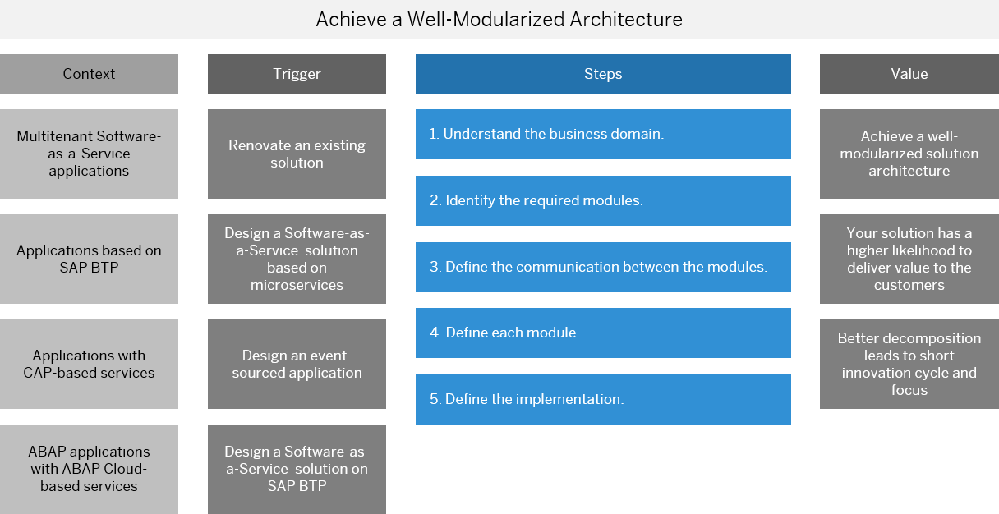

<!-- loioa5b8129692cd42c78c3ab54290e597b6 -->

# From Concept to Code

Before starting to implement an application on SAP BTP, it's better if you do some planning and research beforehand.

<a name="loioa5b8129692cd42c78c3ab54290e597b6__section_ndp_prl_zzb"/>

## Identify the Business Problem

A business problem represents a gap between the desired and actual outcome of a task. It can be any hurdle, situation, or variation that prevents a business from achieving its objectives. A business problem may not have an immediately obvious resolution, and may be masked or hidden by perception and assumption. To define a true problem, you need to remove the factors that obscure the real reason behind the problem.

To solve a problem for an internal or an external customer when using a product, you need to ask questions that can help you understand the customer’s needs, expectations, pain points, and feedback. Some examples of such questions are:

-   What are the tasks that customers are trying to achieve with a product?

-   How do the customers use the product in their daily workflow?

-   What are the main challenges or frustrations that the customers face when the product?

-   How can you improve the product to better serve the customers' needs?

-   How satisfied are the customers with the product and the customer service?

-   What are the benefits or value that the customers get from the product?

-   How do the customers measure the success or impact of the product on their goals?

<a name="loioa5b8129692cd42c78c3ab54290e597b6__section_qgl_kcm_zzb"/>

## Deliver a Cloud Application from Concept to a Final Product

The columns in the following graphic show for which use cases using a well-modularized architecture suits best, what is the motivation, the steps and the benefits.

This image is interactive. Hover over the image and click the highlighted areas so you are placed in the respective cell in the table.

### Context

Let's assume the following scenario: you and your team are tasked to deliver a multitenant application on SAP BTP or SAP S/4HANA Cloud Public Edition and you want to base the application either on SAP Cloud Application Programming Model \(CAP\) or on ABAP Cloud.

### Trigger

Use the following triggers as a motivation to engage in sophisticated design process:

-   Renovating, evolving or reimplementing an existing solution

    This involves transforming a legacy system into a modern, more efficient and scalable solution. Legacy systems often pose difficulties in terms of maintainability, integration with newer technologies, and can be a bottleneck for a business's growth. This transformation process could involve refactoring code, adopting new architecture patterns like microservices, or completely reimplementing the software with a new technology stack.

-   Designing a new Software-as-a-Service solution based on microservices

    Software-as-a-Service is a model where software is provided over the internet on a subscription basis. When designing a new Software-as-a-Service solution based on microservices, the system is decomposed into a collection of services that are independently deployable, scalable, and can be developed by different teams. Each microservice corresponds to a specific business capability and can be developed, deployed and scaled independently. This architectural style promotes flexibility and scalability, and it can speed up the development process by enabling parallel development across teams. It's important to design these services around the business capabilities.

-   Considering more asynchronous behavior and event-sourced applications

    Asynchronous behavior in an application refers to operations that can be executed independently and don't block the flow of the program. This makes the application more responsive and can improve system-wide performance. Event sourcing is an architectural pattern that stores changes to the application state as a sequence of events, rather than just storing the current state. This can provide a full audit trail, simplify debugging by allowing the state of an application at any point in time to be recreated, and can facilitate asynchronous, message-driven architectures. By integrating these into the system, it can enhance the system's scalability and reliability.

-   Designing a Software-as-a-Service application on SAP BTP

    When designing a Software-as-a-Service application on SAP BTP, the application is built to be delivered over the internet and leverages the services provided by SAP BTP. This can include data storage services, AI and machine learning capabilities, analytics and more. Using such a platform can speed up development time, as many of the underlying infrastructure considerations and services are taken care of by the platform.

### Steps

Follow these steps to ensure smooth implementation of your application:

1.  Understand the business domain.

    Understanding the business domain is of the utmost importance. The business domain refers to the area of expertise or business that a software solution is intended to support. This understanding includes the business's processes, rules, norms, and intrinsic challenges. This knowledge forms the basis of the model that the software will encapsulate. Developers should work closely with domain experts to ensure that the software accurately reflects the real-world domain, with all its complexity and nuance. A thorough understanding of the business domain will help in creating software that is useful, flexible, and capable of evolving alongside the business.

2.  Identify the required modules.

    Identifying the required modules means breaking down the overall system into smaller, manageable, and functionally cohesive units. Each module is designed to encapsulate a specific portion of the domain model and is typically aligned with a specific sub-domain or business capability. By identifying the modules, developers can ensure separation of concerns and make the system more maintainable. Each module should be able to operate independently, reducing dependencies and allowing for parallel development and easier testing.

3.  Define the communication between the modules.

    Once the modules are identified, the next step is to define how they will interact with each other. This involves establishing interfaces, contracts, or APIs for communication. This is often guided by the concept of context mapping, which helps to define the relationships and interactions between different related contexts. Communication between modules should be carefully managed to preserve the autonomy of the modules. The communication could be synchronous or asynchronous, and could be based on various patterns like request/response, events, or commands.

4.  Plan the implementation.

    After you have an understanding of the business domain, have identified the required modules, and defined how they will communicate, the next step is to plan the implementation. This is the moment where you decide which technologies, patterns, and practices to use to build each module. This can include selecting the programming languages, databases, message brokers, and other tools that will be used. It also involves choosing the architectural patterns \(like layered architecture, hexagonal architecture, or microservices\) and design patterns that will be applied. The implementation should be guided by the principles of the domain model, encapsulating the business logic in entities, value objects, aggregates, and domain events. Additionally, the implementation should consider non-functional requirements like scalability, performance, security, and maintainability.

### Value

If you follow the steps mentioned in the previous section, you will achieve the following benefits:

-   Well-modularized architecture.

    In the context of software development, a well-modularized architecture refers to the design of a system where the different functionalities and responsibilities are partitioned into distinct modules. Each module encapsulates a specific subset of the system's behavior and can be developed, tested, and maintained independently of the others. Modules are often designed to be loosely coupled, meaning that they interact with each other through well-defined interfaces, but their internals are hidden from each other. This encapsulation increases the maintainability of the system because changes inside one module don't impact the others. It also improves the scalability of the system, as individual modules can be scaled up or down based on their individual requirements. Finally, modularization can increase the speed of development because different teams can work on different modules at the same time without interfering with each other.

-   Higher likelihood to delivery value to your customers.

    The focus is on understanding the business domain and creating a software model that reflects and serves that domain. By aligning the software closely with the business needs, there's a higher likelihood of delivering value to the customer. This comes from a deep understanding of the business, its rules, and its needs. This understanding guides the software development process, ensuring that the software solves the right problems and provides the features that the business actually needs. As a result, the software is more likely to be valuable to the end users, who are the ones interacting with the business domain on a daily basis.

-   Better decomposition that would lead to shorter innovation cycles and clearer focus.

    Decomposition in software design is the process of breaking down a complex system into smaller, manageable parts or components. Better decomposition, often achieved through practices like domain-driven design and microservices architecture, allows for clearer focus on individual parts of the system and can lead to shorter innovation cycles. With a well-decomposed system, teams can focus on specific components or services, understand them thoroughly, and make improvements or innovations without having to understand the entire system. This can significantly shorten the time it takes to go from an idea to a working feature, because changes are localized to specific parts of the system and don't require broad, system-wide understanding or modifications. Moreover, better decomposition can lead to clearer focus because each component or service can be designed around a specific business capability or domain concept. This allows the team working on that component to focus on the specific business problems and user needs related to that capability or concept, rather than being distracted by other parts of the system. This kind of focus can lead to better solutions and more valuable software.

<a name="loioa5b8129692cd42c78c3ab54290e597b6__section_wdv_cct_b1c"/>

## Understand Modularization in General

Modularization is a general programming concept where you separate program functions into independent pieces, called modules. These modules then act like building blocks, with each block containing all the necessary parts to execute a piece of the functionality. When the modules are put together, they make up the executable program.

A modular code is:

-   **Easier to maintain**

    It's easier to read, understand, debug, and modify code that is modularized. It also reduces the risk of introducing errors or conflicts when changing or adding new features. A good modularization also enables reuse of existing modules across different products, which saves time and effort.

-   **Easier to test**

    Each module can be tested individually and independently from the rest of the system. This also facilitates automated testing and continuous integration, which improve the quality and reliability of the software product.

-   **Easier to scale**

    Each module can be deployed, updated, or replaced separately, without affecting the whole system. This also allows for parallel development and faster delivery of new features or bug fixes. A good modularization also supports distributed and cloud-based architectures, which enhance the performance and availability of the software product.

-   **More reliable**

    Each module has a clear and well-defined interface and responsibility. This also reduces the coupling and dependency between modules, which minimizes the impact of failures or errors in one module on the rest of the system. A good modularization also enables fault tolerance and recovery mechanisms, which improve the resilience and robustness of the software product.

-   **More adaptable**

    Each module can be easily modified or extended to meet changing requirements or customer needs. This also increases the flexibility and diversity of the software product, as different modules can be combined or configured in various ways.

-   **Easier to evolve**

    Each module can be evolved independently or collaboratively, without affecting the overall functionality. This also promotes innovation and creativity, as new modules can be created or reused to generate novel solutions or features.

<a name="loioa5b8129692cd42c78c3ab54290e597b6__section_cdc_fct_b1c"/>

## Understand Modularization in the Context of Microservice-Based Architecture

The right modularization is very important in the context of microservices, because microservices are essentially a form of modular software development. Microservices aim to create small, focused, and independent services that communicate through well-defined interfaces and protocols. Each service is responsible for a specific functionality or domain, and can be developed, deployed, and scaled independently from other services. This way, microservices enable a high degree of modularity, flexibility, and agility in software development.

However, not all modularizations are equally effective or beneficial for microservices. A poor modularization can lead to problems such as:

-   **High coupling and low cohesion**

    If the services are not well-defined and separated, they may depend on each other too much, or have too many responsibilities. This can result in tight coupling between services, which makes them hard to change, test, or reuse. It can also result in low cohesion within services, which makes them complex, inconsistent, or redundant. High coupling and low cohesion reduce the maintainability, testability, and reliability of microservices.

-   **Service sprawl and fragmentation**

    If the services are too fine-grained and numerous, they may become difficult to manage, monitor, and coordinate. This can result in service sprawl, which increases the operational complexity and overhead of microservices. It can also result in service fragmentation, which reduces the performance and availability of microservices. Service sprawl and fragmentation reduce the scalability and adaptability of microservices.

-   **Lack of alignment and consistency**

    If the services are not aligned with the business domain and goals, they may not deliver the expected value or quality. This can result in lack of alignment, which reduces the relevance and effectiveness of microservices. It can also result in lack of consistency, which reduces the usability and interoperability of microservices. Lack of alignment and consistency reduce the evolution and innovation of microservices.

The right modularization is essential if you want to benefit from using microservices. For example:

-   **Maintain modules easily**

    The right modularization helps you create simple, consistent, and reusable services that are easy to read, understand, debug, and modify. It also enables the isolation and decoupling of services, which reduces the risk of errors or conflicts when changing or adding new features.

-   **Test each service individually and independently from the rest of the system**

    The right modularization enables you to use automated testing and continuous integration, which improve the quality and reliability of the software product.

-   **Deploy, update, or replace each service separately, without affecting the whole system**

    The right modularization supports distributed and cloud-based architectures, which enhance the performance and availability of the software product.

-   **Have clear and well-defined interface and responsibility of each service**

    The right modularization reduces the coupling and dependency between services, which minimize the impact of failures or errors in one service on the rest of the system. It also enables fault tolerance and recovery mechanisms, which improve the resilience and robustness of the software product.

-   **Modify or extend each service to meet changing requirements or customer needs**

    The right modularization increases the flexibility and diversity of the software product, as different services can be combined or configured in various ways.

-   **Evolve each service independently or collaboratively, without affecting the overall system functionality**

    The right modularization promotes innovation and creativity, as new services can be created or reused to generate novel solutions or features.

<a name="loioa5b8129692cd42c78c3ab54290e597b6__section_b35_hct_b1c"/>

## Learn Why Domain-Driven Design Is an Adequate Approach

Domain-driven design is a major software design approach, focusing on modeling software to match a domain according to input from that domain's experts. Under domain-driven design, the structure and language of software code \(class names, class methods, class variables\) should match the business domain.

Domain-driven design helps achieving the traits of a good modularization by:

-   **Placing the project's primary focus on the core domain and domain logic**

    Domain-driven design emphasizes close collaboration between domain experts and developers to create software that accurately models the problem domain. By focusing on the domain's core concepts, relationships, and behavior, domain-driven design enables you to create more robust, flexible, and maintainable systems.

-   **Building complex designs on the model of the domain**

    Domain-driven design helps you to define the boundaries of each module by identifying the core concepts, aggregates, and their associated business logic. This enables teams to develop and maintain these modules independently, promoting scalability and modularization within the overall system.

-   **Initiating a creative collaboration between technical and domain experts to iteratively refine a conceptual model that addresses particular domain problems**

    Domain-driven design fosters a common language shared by domain experts, users, and developers: the ubiquitous language. The ubiquitous language is used in the domain model and for describing system requirements. This enhances the communication and understanding among the stakeholders, and facilitates the adaptation and evolution of the software product.

<a name="loioa5b8129692cd42c78c3ab54290e597b6__section_dcz_5kk_p1c"/>

## Learn About the Domain-Driven Design Starter Modeling Process

The domain-driven design starter modeling process is a process for learning and applying domain-driven design in practice. It covers eight steps from aligning with the business model to coding the domain model. It is flexible and iterative, and suitable for beginners who want to master domain-driven design. See the [Domain-Driven Design Starter Modeling Process](https://github.com/ddd-crew/ddd-starter-modelling-process) GitHub repository that is part of the [Domain-Driven Design Crew](https://github.com/ddd-crew) GitHub organization.

<a name="loioa5b8129692cd42c78c3ab54290e597b6__section_alc_4ct_b1c"/>

## Check How Complex Your Scenario Is

Check which requirements your scenario has and sum up the points for the respective requirement. If your score above is 7 or higher, you should evaluate how to leverage the concept and tools of the domain-driven design in your project.

We also recommend that you follow the domain-driven design modeling process.

See [Domain-Driven Design Starter Modeling Process](https://github.com/ddd-crew/ddd-starter-modelling-process).

****

<table>
<tr>
<th valign="top">

Scenario Requirements

</th>
<th valign="top">

Points

</th>
<th valign="top">

Comments

</th>
</tr>
<tr>
<td valign="top">

For applications that work with the four functions: create, read, update, delete \(CRUD\), and only perform simple database queries, no special design is required. A simple database tool with a user interface is enough.

</td>
<td valign="top">

0

</td>
<td valign="top">

A simple application does have the complexity to benefit elaborated design methods.

</td>
</tr>
<tr>
<td valign="top">

You have a simple application if it has up to 30 use cases. You can build it with a CAP application that works with the four functions: create, read, update, delete \(CRUD\).

</td>
<td valign="top">

1

</td>
<td valign="top">

Just for reference, this means your application does not have more than 30 functions.

</td>
</tr>
<tr>
<td valign="top">

Your application has between 30 and 40 use cases.

</td>
<td valign="top">

2

</td>
<td valign="top">

Make sure you don't underestimate any hidden complexities.

However, having many methods or functions doesn't always mean high complexity. They might be simple and well-structured. It's when a class or module has many responsibilities, indicated by methods or functions that perform widely varying tasks, that complexity becomes a challenge.

</td>
</tr>
<tr>
<td valign="top">

Your application may not be complex now, but it could grow later.

</td>
<td valign="top">

3

</td>
<td valign="top">

Talk to domain experts to discuss the complexity of your application. The complexity increases with the number of features that the stakeholders need.

</td>
</tr>
<tr>
<td valign="top">

Your application will change a lot over time, and you don’t know what kind of changes will happen.

</td>
<td valign="top">

4

</td>
<td valign="top">

You require a sophisticated design method to manage the complexity of refactoring your model over time.

</td>
</tr>
<tr>
<td valign="top">

You are building an application in a new and exciting domain that nobody has done before. This means it could be complex and challenging.

</td>
<td valign="top">

5

</td>
<td valign="top">

You need to collaborate with domain experts and try different models to make your application work.

</td>
</tr>
</table>

**Related Information**  

[Domain-Driven Design Crew GitHub Organization](https://github.com/ddd-crew)

[Domain-Driven Design Community at SAP](https://github.com/SAP/curated-resources-for-domain-driven-design)

