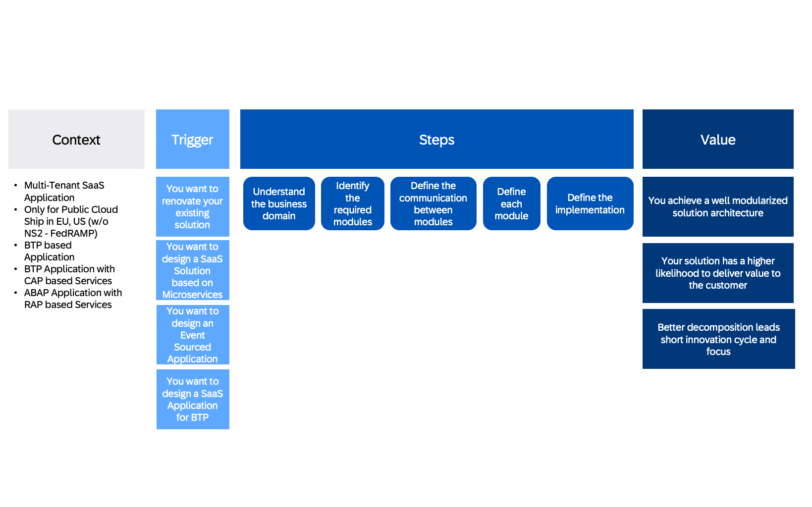

# From Concept to Code

## What is your business problem?

A business problem is a situation that creates a gap between the desired and actual outcomes. It can be any hurdle, situation, or variation that prevents a business from achieving its objectives. A business problem may not have an immediately obvious resolution, and may be masked or hidden by perception and assumption. To define a true problem, one needs to remove the factors that obscure the real reason behind the problem.

To solve a problem for a (internal / external) customer with a product, a person needs to ask questions that can help them understand the customer’s needs, expectations, pain points, and feedback. Some examples of such questions are:

* What are they trying to achieve with our product?
* How do they use our product in their daily workflow?
* What are the main challenges or frustrations that they face with our product?
* How can we improve our product to better serve their needs?
* How satisfied are they with our product and our customer service?
* What are the benefits or value that they get from our product?
* How do they measure the success or impact of our product on their goals?

## Value Stream of Designing Cloud Applications

 

### Context

You and your team are tasked to deliver a multi-tenant application for public cloud on BTP or S/4HANA Public Cloud and you want to either base the application on CAP or RAP.

### Trigger

One the following triggers should encourage you to engage in sophisticated design process:

1. **Renovating, Evolving or Reimplementing an Existing Solution**

   This involves transforming a legacy system into a modern, more efficient and scalable solution. Legacy systems often pose difficulties in terms of maintainability, integration with newer technologies, and can be a bottleneck for a business's growth. This transformation process could involve refactoring code, adopting new architecture patterns (like microservices), or completely reimplementing the software with a new technology stack.

2. **Designing a New SaaS Solution Based on Microservices**

   Software as a Service (SaaS) is a model where software is provided over the internet on a subscription basis. When designing a new SaaS solution based on microservices, the system is decomposed into a collection of services that are independently deployable, scalable, and can be developed by different teams. Each microservice corresponds to a specific business capability and can be developed, deployed and scaled independently. This architectural style promotes flexibility and scalability, and it can speed up the development process by enabling parallel development across teams. It's important to design these services around the business capabilities.

3. **Considering More Asynchronous Behavior and Event-Sourced Applications**

   Asynchronous behavior in an application refers to operations that can be executed independently and do not block the flow of the program. This makes the application more responsive and can improve system-wide performance. Event sourcing is an architectural pattern that stores changes to the application state as a sequence of events, rather than just storing the current state. This can provide a full audit trail, simplify debugging by allowing the state of an application at any point in time to be recreated, and can facilitate asynchronous, message-driven architectures. By integrating these into the system, it can enhance the system's scalability and reliability.

4. **Designing a SaaS Application on the BTP**

   When designing a SaaS application on the BTP, the application is built to be delivered over the internet and leverages the services provided by the BTP. This can include data storage services, AI and machine learning capabilities, analytics and more. Using such a platform can speed up development time, as many of the underlying infrastructure considerations and services are taken care of by the platform.

### Steps

1. **Understand the Business Domain**

   Understanding the business domain is of the utmost importance. The business domain refers to the area of expertise or business that a software solution is intended to support. This understanding includes the business's processes, rules, norms, and intrinsic challenges. This knowledge forms the basis of the model that the software will encapsulate. Developers should work closely with domain experts to ensure that the software accurately reflects the real-world domain, with all its complexity and nuance. A thorough understanding of the business domain will help in creating software that is useful, flexible, and capable of evolving alongside the business.

2. **Identify the Required Modules**

   Identifying the required modules means breaking down the overall system into smaller, manageable, and functionally cohesive units. Each module is designed to encapsulate a specific portion of the domain model and is typically aligned with a specific sub-domain or business capability. By identifying the modules, developers can ensure separation of concerns and make the system more maintainable. Each module should be able to operate independently, reducing dependencies and allowing for parallel development and easier testing.

3. **Define the Communication Between the Modules**

   Once the modules are identified, the next step is to define how they will interact with each other. This involves establishing interfaces, contracts, or APIs for communication. This is often guided by the concept of context mapping, which helps to define the relationships and interactions between different bounded contexts. Communication between modules should be carefully managed to preserve the autonomy of the modules and prevent 'leaky abstractions'. The communication could be synchronous or asynchronous, and could be based on various patterns like request/response, events, or commands.

4. **Define the Implementation**

   After you have an understanding of the business domain, have identified the required modules, and defined how they will communicate, the next step is to define the implementation. This is the phase where you decide on the technologies, patterns, and practices to be used to build each module. This can include selecting the programming languages, databases, message brokers, and other tools that will be used. It also involves deciding on the architectural patterns (like layered architecture, hexagonal architecture, or microservices) and design patterns that will be applied. The implementation should be guided by the principles of the domain model, encapsulating the business logic in entities, value objects, aggregates, and domain events. Additionally, the implementation should consider non-functional requirements like scalability, performance, security, and maintainability.

### Value

Following the step before you might be able to achieve the following:

1. **Well Modularized Architecture**

    In the context of software development, a well modularized architecture refers to the design of a system where the different functionalities and responsibilities are partitioned into distinct modules. Each module encapsulates a specific subset of the system's behavior and can be developed, tested, and maintained independently of the others. Modules are often designed to be loosely coupled, meaning that they interact with each other through well-defined interfaces, but their internals are hidden from each other. This encapsulation increases the maintainability of the system because changes inside one module don't impact the others. It also improves the scalability of the system, as individual modules can be scaled up or down based on their individual requirements. Finally, modularization can increase the speed of development because different teams can work on different modules at the same time without interfering with each other.

2. **Higher Likelihood of Delivering Value to the Customer**

    The focus is on understanding the business domain and creating a software model that reflects and serves that domain. By aligning the software closely with the business needs, there's a higher likelihood of delivering value to the customer. This comes from a deep understanding of the business, its rules, and its needs. This understanding guides the software development process, ensuring that the software solves the right problems and provides the features that the business actually needs. As a result, the software is more likely to be valuable to the end users, who are the ones interacting with the business domain on a daily basis.

3. **Better Decomposition Leading to Shorter Innovation Cycles and Clearer Focus**

    Decomposition in software design is the process of breaking down a complex system into smaller, manageable parts or components. Better decomposition, often achieved through practices like Domain-Driven Design (DDD) and microservices architecture, allows for clearer focus on individual parts of the system and can lead to shorter innovation cycles. With a well-decomposed system, teams can focus on specific components or services, understand them thoroughly, and make improvements or innovations without having to understand the entire system. This can significantly shorten the time it takes to go from an idea to a working feature (the innovation cycle), because changes are localized to specific parts of the system and don't require broad, system-wide understanding or modifications. Moreover, better decomposition can lead to clearer focus because each component or service can be designed around a specific business capability or domain concept. This allows the team working on that component to focus on the specific business problems and user needs related to that capability or concept, rather than being distracted by other parts of the system. This kind of focus can lead to better solutions and more valuable software.

## Modularization Matters

### In General

Modularization is a general programming concept where developers separate program functions into independent pieces, called modules. These modules then act like building blocks, with each block containing all the necessary parts to execute one aspect of functionality. When the modules are put together, they make up the executable program.

A good modularization has many benefits for software product development, such as:

* **Maintainability**: Modular code is easier to read, understand, debug, and modify. It also reduces the risk of introducing errors or conflicts when changing or adding new features. A good modularization also enables reuse of existing modules across different products, which saves time and effort.
* **Testability**: Modular code is easier to test, as each module can be tested individually and independently from the rest of the system. This also facilitates automated testing and continuous integration, which improve the quality and reliability of the software product.
* **Scalability**: Modular code is easier to scale, as each module can be deployed, updated, or replaced separately, without affecting the whole system. This also allows for parallel development and faster delivery of new features or bug fixes. A good modularization also supports distributed and cloud-based architectures, which enhance the performance and availability of the software product.
* **Reliability**: Modular code is more reliable, as each module has a clear and well-defined interface and responsibility. This also reduces the coupling and dependency between modules, which minimizes the impact of failures or errors in one module on the rest of the system. A good modularization also enables fault tolerance and recovery mechanisms, which improve the resilience and robustness of the software product.
* **Adaptability**: Modular code is more adaptable, as each module can be easily modified or extended to meet changing requirements or customer needs. This also increases the flexibility and diversity of the software product, as different modules can be combined or configured in various ways.
* **Evolution**: Modular code is more evolvable, as each module can be evolved independently or collaboratively, without affecting the overall system functionality. This also promotes innovation and creativity, as new modules can be created or reused to generate novel solutions or features.

On the other hand, a poor modularization can have negative consequences for software product development, such as:

* **Maintainability**: Poorly modularized code is harder to read, understand, debug, and modify. It also increases the risk of introducing errors or conflicts when changing or adding new features. A poor modularization also hinders reuse of existing modules across different products, which wastes time and effort.
* **Testability**: Poorly modularized code is harder to test, as each module cannot be tested individually and independently from the rest of the system. This also complicates automated testing and continuous integration, which degrade the quality and reliability of the software product.
* **Scalability**: Poorly modularized code is harder to scale, as each module cannot be deployed, updated, or replaced separately, without affecting the whole system. This also limits parallel development and slows down delivery of new features or bug fixes. A poor modularization also restricts distributed and cloud-based architectures, which reduce the performance and availability of the software product.
* **Reliability**: Poorly modularized code is less reliable, as each module has a vague and poorly-defined interface and responsibility. This also increases the coupling and dependency between modules, which maximizes the impact of failures or errors in one module on the rest of the system. A poor modularization also disables fault tolerance and recovery mechanisms, which lower the resilience and robustness of the software product.
* **Adaptability**: Poorly modularized code is less adaptable, as each module can be hardly modified or extended to meet changing requirements or customer needs. This also decreases the flexibility and diversity of the software product, as different modules can be combined or configured in limited ways.
* **Evolution**: Poorly modularized code is less evolvable, as each module can be evolved only with difficulty or not at all, affecting the overall system functionality. This also inhibits innovation and creativity, as new modules can be hardly created or reused to generate novel solutions or features.

### In the context of microservice based architecture

The right modularization is very important in the context of microservices, because microservices are essentially a form of modular software development. Microservices aim to create small, focused, and independent services that communicate through well-defined interfaces and protocols. Each service is responsible for a specific functionality or domain, and can be developed, deployed, and scaled independently from other services. This way, microservices enable a high degree of modularity, flexibility, and agility in software development.

However, not all modularizations are equally effective or beneficial for microservices. A poor modularization can lead to problems such as:

* **High coupling and low cohesion**: If the services are not well-defined and separated, they may depend on each other too much, or have too many responsibilities. This can result in tight coupling between services, which makes them hard to change, test, or reuse. It can also result in low cohesion within services, which makes them complex, inconsistent, or redundant. High coupling and low cohesion reduce the maintainability, testability, and reliability of microservices.
* **Service sprawl and fragmentation**: If the services are too fine-grained and numerous, they may become difficult to manage, monitor, and coordinate. This can result in service sprawl, which increases the operational complexity and overhead of microservices. It can also result in service fragmentation, which reduces the performance and availability of microservices. Service sprawl and fragmentation reduce the scalability and adaptability of microservices .
* **Lack of alignment and consistency**: If the services are not aligned with the business domain and goals, they may not deliver the expected value or quality. This can result in lack of alignment, which reduces the relevance and effectiveness of microservices. It can also result in lack of consistency, which reduces the usability and interoperability of microservices. Lack of alignment and consistency reduce the evolution and innovation of microservices .

Therefore, the right modularization is essential for achieving the benefits of microservices, such as:

* **Maintainability**: The right modularization enables the creation of simple, consistent, and reusable services that are easy to read, understand, debug, and modify. It also enables the isolation and decoupling of services, which reduces the risk of errors or conflicts when changing or adding new features.
* **Testability**: The right modularization enables the testing of each service individually and independently from the rest of the system. It also facilitates automated testing and continuous integration, which improve the quality and reliability of the software product.
* **Scalability**: The right modularization enables the deployment, update, or replacement of each service separately, without affecting the whole system. It also supports distributed and cloud-based architectures, which enhance the performance and availability of the software product.
* **Reliability**: The right modularization enables the clear and well-defined interface and responsibility of each service. It also reduces the coupling and dependency between services, which minimizes the impact of failures or errors in one service on the rest of the system. It also enables fault tolerance and recovery mechanisms, which improve the resilience and robustness of the software product.
* **Adaptability**: The right modularization enables the modification or extension of each service to meet changing requirements or customer needs. It also increases the flexibility and diversity of the software product, as different services can be combined or configured in various ways .
* **Evolution**: The right modularization enables the evolution of each service independently or collaboratively, without affecting the overall system functionality. It also promotes innovation and creativity, as new services can be created or reused to generate novel solutions or features .

## Why Domain-Driven Design is an adequate approach

Domain-Driven Design (DDD) is a major software design approach, focusing on modeling software to match a domain according to input from that domain's experts. Under DDD, the structure and language of software code (class names, class methods, class variables) should match the business domain.

Domain-Driven Design helps achieving the traits of a good modularization by:

* **Placing the project's primary focus on the core domain and domain logic**: DDD emphasizes close collaboration between domain experts and developers to create software that accurately models the problem domain. By focusing on the domain's core concepts, relationships, and behavior, DDD enables the creation of more robust, flexible, and maintainable systems.
* **Basing complex designs on a model of the domain**: DDD helps define the boundaries of each module by identifying the core concepts, aggregates, and their associated business logic. This enables teams to develop and maintain these modules independently, promoting scalability and modularization within the overall system.
* **Initiating a creative collaboration between technical and domain experts to iteratively refine a conceptual model that addresses particular domain problems**: DDD fosters a common language shared by domain experts, users, and developers—the ubiquitous language. The ubiquitous language is used in the domain model and for describing system requirements. This enhances the communication and understanding among the stakeholders, and facilitates the adaptation and evolution of the software product.

## How complex is your project?

| If your project                                                                                                                                                | Points | Supporting Thoughts                                                                                                                                           |
| -------------------------------------------------------------------------------------------------------------------------------------------------------------- | ------ | ------------------------------------------------------------------------------------------------------------------------------------------------------------- |
| For a pure CRUD applications that only perform simple database queries, no special design is required. A simple database tool with a user interface is enough. | 0      | A simple application does have the complexity to benefit elaborated design methods.                                                                           |
| You have a simple system if it has less than 30 user stories with little logic. You can easily build it with straight forward CRUD CAP Application.            | 1      | Just for reference, this means your application does not have more than 30 function at all.                                                                   |
| Your application has between 30 and 40 user stories or use cases.                                                                                              | 2      | Beware of hidden complexity! We developers tend to underestimate it.                                                                                          |
| Your application may not be complex now, but it could grow later. Don’t worry, there is a way to find out the true situation.                                  | 3      | How to know if your system is complex? Talk to domain experts and see their reactions. If they want more features, it’s complex. If they are bored, it’s not. |
| Your system will change a lot over time, and you don’t know what kind of changes will happen.                                                                  | 4      | You require a sophisticated design method to manage the complexity of refactoring your model over time.                                                       |
| You are working on a new and exciting domain that nobody has done before. This means it could be complex and challenging.                                      | 5      | You need to collaborate with domain experts and try different models to make your system work.                                                                |

If your score above is 7 or higher, you should evaluate how to leverage the concept and tools of [Domain-Driven Design](domain-driven-design.md) in your project.
Therefore we strongly recommend to follow the [DDD Modelling Process](domain-modelling-process.md).

## Resources

**Evolutionary Modularity Assessment:**

1. [An Evolution Model for Software Modularity Assessment](https://ieeexplore.ieee.org/abstract/document/4273470/): This paper explores an evolution model for assessing software modularity.

2. [Using structural and semantic measures to improve software modularization](https://link.springer.com/article/10.1007/s10664-012-9226-8): The article discusses how structural and semantic measures can enhance software modularization.

3. [Specialization Can Drive the Evolution of Modularity | PLOS](https://journals.plos.org/ploscompbiol/article?id=10.1371/journal.pcbi.1000719): This publication explores how specialization can influence the evolution of modularity.

4. [An Evolutionary Approach to Software Modularity Analysis](https://ieeexplore.ieee.org/document/4228628/): The paper presents an evolutionary approach to analyzing software modularity.

**Modules vs. Microservices:**

1. [Modules vs. microservices – O’Reilly](https://www.oreilly.com/radar/modules-vs-microservices/): This article on O'Reilly discusses the comparison between modules and microservices.

2. [How Microservices And APIs Can Make Your Company Modular - Forbes](https://www.forbes.com/sites/forbestechcouncil/2022/02/17/how-microservices-and-apis-can-make-your-company-modular/): Forbes explores how microservices and APIs contribute to making a company modular.

3. [Microservices vs. Service-Oriented Architecture - Baeldung](https://www.baeldung.com/cs/microservices-soa-differences): This resource compares microservices and service-oriented architecture (SOA).

**Domain-Driven Design (DDD) in Modern Software Architecture:**

1. [Domain-Driven Design (DDD) in Modern Software Architecture - Medium](https://blog.bitsrc.io/demystifying-domain-driven-design-ddd-in-modern-software-architecture-b57e27c210f7): This Medium article demystifies Domain-Driven Design (DDD) in modern software architecture.

2. [Domain-driven design - Wikipedia](https://en.wikipedia.org/wiki/Domain-driven_design): The Wikipedia page provides an overview of Domain-Driven Design.

3. [Design and Implementation of a DDD-Based Modular Monolith - InfoQ](https://www.infoq.com/news/2019/09/design-ddd-modular-monolith/): This resource on InfoQ discusses the design and implementation of a DDD-based modular monolith.
