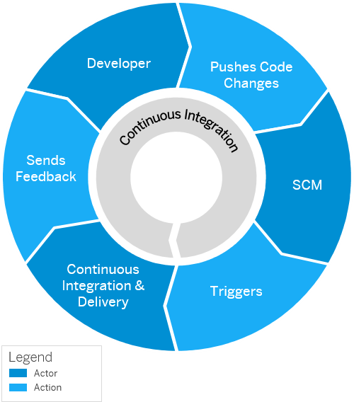
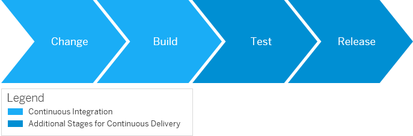

<!-- loio8ee535335d2a4b7e89e9919a664b9b35 -->

# Introducing Continuous Integration and Delivery \(CI/CD\)

The acronym CI/CD combines two proven DevOps concepts for automation, which are integral to application development and build on each other: **Continuous Integration \(CI\)** and **Continuous Delivery \(CD\)**.

<a name="loio8ee535335d2a4b7e89e9919a664b9b35__section_bjx_gvk_kfc"/>

## Continuous Integration \(CI\)

The following video provides a brief introduction to Continuous Integration:

CI describes a software development process in which various team members frequently integrate their contributions into a single main line. Before each integration, the changes are verified through builds and automated testing. The more code you need to integrate, the harder it becomes, and the more problems may arise. Therefore, it is ideal to perform small integrations more often – in other words, continuously. This allows you to detect errors as quickly as possible and prevents integration problems from building up until the end of the development cycle.

The following figure shows the basic flow for Continuous Integration:

  
  
**Basic Flow for Continuous Integration**

The Continuous Integration basic flow comprises the following steps:

1.  The Developer writes code and pushes the code changes to a repository on a central source code management system \(SCM\).
2.  The Source Code Management System triggers the Continuous Integration \(CI\) server.
3.  The Continuous Integration server runs automated builds and tests, then immediately sends feedback about the outcomes to the developer.

As you can see from the figure, Continuous Integration is a cyclical process. As soon as the CI server sends its feedback to the developer, the flow starts over. The developers either correct their previous code change, which must then be built and tested again, or they start working on an entirely new one.

<a name="loio8ee535335d2a4b7e89e9919a664b9b35__section_lzd_zxk_kfc"/>

## Continuous Delivery \(CD\)

The concept of Continuous Delivery \(CD\) expands on that of Continuous Integration. It adds the aspect that any change successfully passing the tests is immediately ready for deployment to production, both from a technical and qualitative perspective.

The following figure shows the relation between Continuous Integration and Continuous Delivery:

  
  
**Relation Between CI and CD**

The Continuous Delivery process ensures that the most current version is successfully built, tested, and provided in a shippable format. Based on the release decision by the development team or delivery manager, it can be shipped to customers or deployed to production at any time.

<a name="loio8ee535335d2a4b7e89e9919a664b9b35__section_k1s_myk_kfc"/>

## Continuous Integration Principles

The Continuous Integration process, which forms the foundation of the Continuous Integration and Delivery \(CI/CD\) concepts, is based on several principles. For a clearer understanding, check out the following lesson from the "Discovering DevOps with SAP BTP" learning journey, where three of these principles are explained using an analogy: [Explaining Continuous Integration Principles](https://learning.sap.com/learning-journeys/discovering-devops-with-sap-btp/explaining-continuous-integration-principles_fa206662-72d6-488c-8d23-879307a93502)

For detailed explanations of all CI principles, refer to the following documentation: [Continuous Integration Principles](https://help.sap.com/docs/CICD_OVERVIEW/ee5a61247061455ab232c19179fe4c3b/30b2e1d48f634b03a29733c9f88ef688.html)

**Related Information**  

[Explaining the Continuous Integration and Delivery Process Flow](https://learning.sap.com/learning-journeys/discovering-devops-with-sap-btp/explaining-the-continuous-integration-and-delivery-process-flow_df3f0c8e-b721-46aa-b231-025ccee8c9de)

[Continuous Integration and Delivery Process Flows](https://help.sap.com/docs/CICD_OVERVIEW/ee5a61247061455ab232c19179fe4c3b/436c92cdb53c40f788e6d60fd8dc9615.html)

[Explaining Actors in a CI/CD Process Flow](https://learning.sap.com/learning-journeys/discovering-devops-with-sap-btp/explaining-actors-in-a-ci-cd-process-flow_f854de48-91ae-426c-b389-8ea25a5cec83)

[Actors in a CI/CD Process Flow](https://help.sap.com/docs/CICD_OVERVIEW/ee5a61247061455ab232c19179fe4c3b/e4976f4a16474fe0b1d57e9280ecc38d.html)

<a name="concept_clm_xzk_kfc"/>

<!-- concept\_clm\_xzk\_kfc -->

## SAP Continuous Integration and Delivery

SAP Continuous Integration and Delivery is a service on SAP BTP that helps development teams collaborate more effectively, improve the quality of their software, and accelerate their delivery process. It provides pre-built CI/CD pipelines tailored for SAP-specific use cases, which can be connected to a source repository to automatically build, test, and deploy code changes. This helps identify and prevent integration problems early in the development process.

The following video provides a brief introduction to SAP Continuous Integration and Delivery:

The Continuous Integration & Delivery service focuses on two key benefits: **Simplicity** and **Flexibility**.

<a name="concept_clm_xzk_kfc__section_zms_h1l_kfc"/>

## Simplicity

SAP Continuous Integration and Delivery stands out for its ease of use, offering predefined CI/CD pipelines that can be used right out of the box. These pipelines require minimal configuration, making them accessible even for users without extensive CI/CD expertise. Additionally, the service includes all the necessary infrastructure, eliminating the need for users to manage it themselves.

<a name="concept_clm_xzk_kfc__section_s4x_31l_kfc"/>

## Flexibility

SAP Continuous Integration and Delivery provides a high degree of flexibility, allowing users to customize pipelines with additional commands, credentials, and variables. This flexibility ensures the service not only covers standard use cases but also addresses more complex scenarios. Users can expand their pipelines with various tasks executed before or after specific stages, using additional commands. Moreover, extra credentials and variables allow for further customization of CI/CD jobs.

For a detailed overview and various demos on how to create CI/CD jobs in SAP Continuous Integration and Delivery, take a look at the following lesson in the 'Discovering DevOps with SAP BTP' learning journey: [Creating a Basic CI/CD Job with SAP Continuous Integration and Delivery](https://learning.sap.com/learning-journeys/discovering-devops-with-sap-btp/creating-a-basic-ci-cd-job-with-sap-continuous-integration-and-delivery_c5623312-66f2-41c1-83cb-ca589edceb41)

**Related Information**  

[SAP Continuous Integration and Delivery](https://help.sap.com/docs/continuous-integration-and-delivery)

[What Is SAP Continuous Integration and Delivery](https://help.sap.com/docs/continuous-integration-and-delivery/sap-continuous-integration-and-delivery/what-is-sap-continuous-integration-and-delivery?language=en-US)

