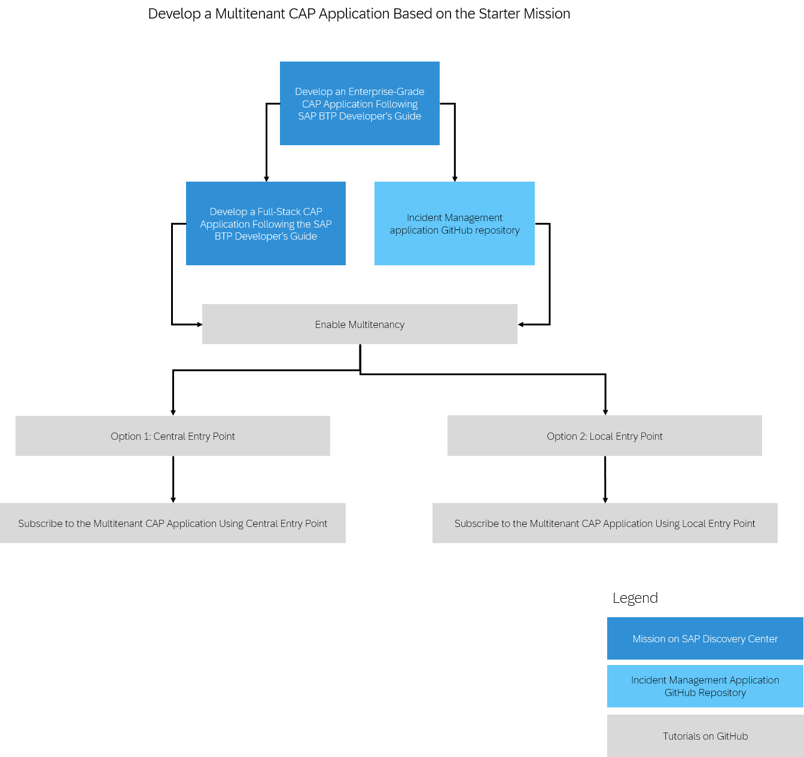

<!-- loio6d2cbe949ab84e13ba8999fe98c2f43e -->

# Mission: Develop a Multitenant CAP Application

SAP BTP provides a multitenant functionality that allows application providers to own, deploy, and operate tenant-aware applications for multiple consumers, with reduced costs. For example, the application provider upgrades the application for all your consumers instead of performing each update individually, or share resources across multiple consumers. The application consumers launch the applications using consumer-specific URLs, and configure certain application features.

With tenant-aware applications, you can:

-   Separate data securely for each tenant

-   Save resources by sharing them among tenants

-   Update applications efficiently, in a single step

To try out the multitenant functionality on the Incident Management sample application, see [Develop a Multitenant CAP Application Following the SAP BTP Developer's Guide](https://discovery-center.cloud.sap/protected/index.html#/missiondetail/4502/4789/).

This image is interactive. Click the highlighted areas so you open the respective tutorial or mission.

