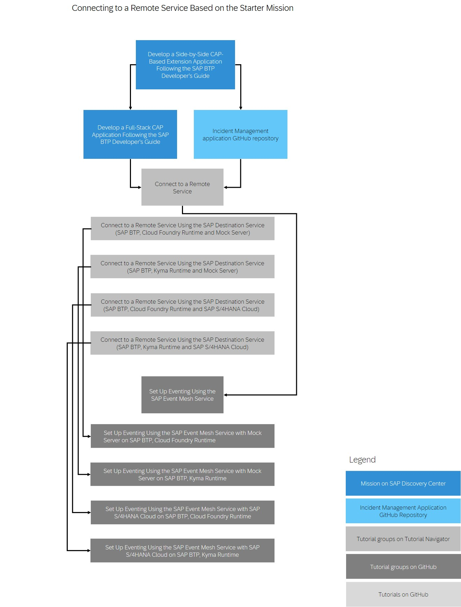

<!-- loio2289e25a0e494f03867c195454b6eaea -->

# Mission: Develop a Side-by-Side CAP-Based Extension Application

Using the SAP BTP Developer’s Guide you can implement side-by-side SAP Cloud Application Programming Model \(CAP\)-based extension applications and deploy them in SAP BTP. The **Develop a Side-by-Side CAP-Based Extension Application Following the SAP BTP Developer’s Guide** mission includes tracks for a remote service connectivity and eventing. In the scenario, an SAP S/4HANA Cloud system is used. If you don't have such a system and you still want to try out the mission, you can use a mock server instead. Depending on what you choose, there are 8 different options:

-   Connect to a remote service

    -   Option 1a: SAP BTP, Cloud Foundry runtime and mock server

    -   Option 2a: SAP BTP, Cloud Foundry runtime and SAP S/4HANA Cloud

    -   Option 3a: SAP BTP, Kyma runtime and mock server

    -   Option 4a: SAP BTP, Kyma runtime and SAP S/4HANA Cloud

-   Implement eventing

    -   Option 1b: SAP BTP, Cloud Foundry runtime and mock server

    -   Option 2b: SAP BTP, Cloud Foundry runtime and SAP S/4HANA Cloud

    -   Option 3b: SAP BTP, Kyma runtime and mock server

    -   Option 4b: SAP BTP, Kyma runtime and SAP S/4HANA Cloud

Out of these 8 options, you can choose one option for the remote service and the corresponding option for the eventing. If you are interested in the remote service connectivity, you don't have to finish the eventing option as well. However, if you are interested in the eventing part, you have to finish the respective remote service connectivity option.

See [Develop a Side-by-Side CAP-Based Extension Application Following the SAP BTP Developer’s Guide](https://discovery-center.cloud.sap/protected/index.html#/missiondetail/4426/4712/).

This image is interactive. Click the highlighted areas so you open the respective tutorial or mission.

