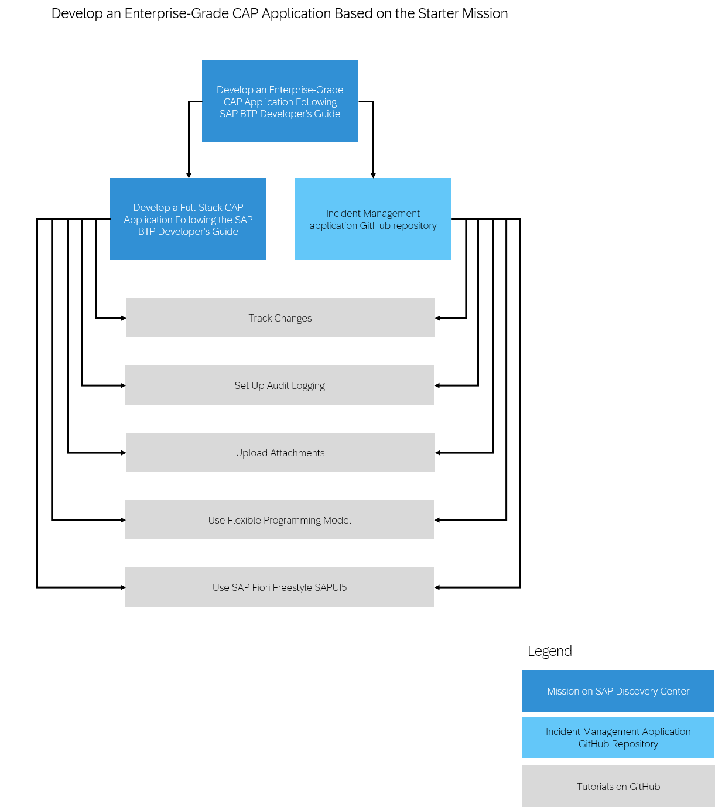

<!-- loiob5be78656d614f91bf436d6b93b593e4 -->

# Mission: Develop an Enterprise-Grade CAP Application

You can develop enterprise-grade CAP applications and deploy them in SAP BTP. The **Develop an Enterprise-Grade CAP Application Following the SAP BTP Developer’s Guide** mission includes options for tracking changes, adding audit logs, and uploading attachments.

See [Develop an Enterprise-Grade CAP Application Following the SAP BTP Developer’s Guide](https://discovery-center.cloud.sap/protected/index.html#/missiondetail/4431/4717/).

This image is interactive. Click the highlighted areas so you open the respective tutorial or mission.

