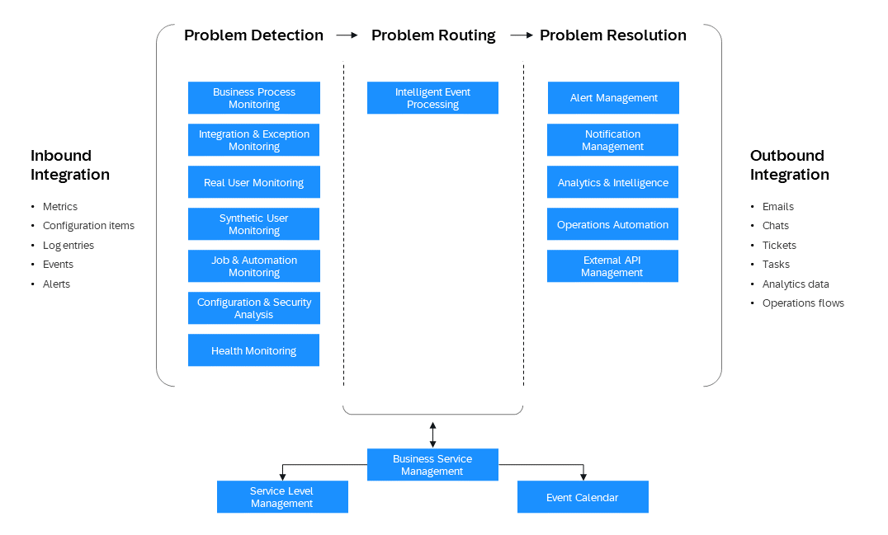

<!-- loio34065a44e2ef4907a7482221ce3383ec -->

# Operate

<a name="loio34065a44e2ef4907a7482221ce3383ec__section_ilq_kdr_pgc"/>

## Use SAP Cloud ALM as a Centralized Operation Platform

SAP Cloud ALM, where ALM stands for application lifecycle management, is included in your SAP Cloud Service subscription containing Enterprise Support, cloud editions, in SAP Enterprise Support and in Product Support for Large Enterprises.

SAP Cloud ALM helps you to implement and operate intelligent cloud and hybrid business solutions. You benefit from an out-of-the-box, native cloud solution running on SAP BTP, designed as the central entry point to manage your complete SAP landscape with content-driven guided implementation and highly automated operations.

With the operations solutions in SAP Cloud ALM, you can handle both SAP BTP-based SaaS applications and your own applications.

SAP Cloud ALM for operations provides a personalized and unified operations user experience. You can use purpose-driven different monitoring, analysis, and management use cases optimized for certain operations aspects. SAP Cloud ALM for operations empowers you to understand the health of your SAP business solutions and acts as collaboration platform between lines of business and IT.

Under [Supported Solutions](https://help.sap.com/docs/cloud-alm/setup-administration/supported-solutions), you see which monitoring capabilities are available with SAP Cloud ALM. Under *SAP Solution*, filter for SAP BTP and check the supported services from the operations area.

Benefit from the powerful *Intelligent Event Processing*, embedded analytics, and intelligence functionality with a large variety of inbound and outbound integration. *Synthetic User Monitoring* monitors the performance and availability of web applications from a client-side perspective based on Selenium-based scripts. *Business Service Management* consolidates all operational events at business service level and shows them in a well-arranged event calendar.

Specifically for Java and Node.js custom-built applications in SAP BTP, Cloud Foundry runtime, there are the Data Collection Instrumentation Libraries based on Open Telemetry designed to enable the data collection infrastructure in SAP Cloud ALM. With these libraries, you can collect data for the following use cases:

-   *Real User Monitoring*: Leverage both front-end and back-end measurements on single request level.

-   *Health Monitoring*: Gain insights on application health based on technical metrics.

-   *Integration and Exception Monitoring*: Collect and react on exceptions raised by the application.

-   *Job and Automation Monitoring*: Monitor SAP Job Scheduling Service jobs.

SAP Cloud ALM is the central place to integrate and access the monitoring of your existing IT service management processes, such as ticketing systems.

Inbound and outbound APIs enable you to integrate data from your own applications. For more information, see the [API Guide for SAP Cloud ALM](https://help.sap.com/docs/cloud-alm/apis/api-reference).

See:

-   [Implement SAP Cloud ALM](https://help.sap.com/docs/cloud-alm/setup-administration/provisioning) via SAP for Me

-   Application help for [SAP Cloud ALM for Operations](https://help.sap.com/docs/cloud-alm/applicationhelp/operations)

-   [SAP Cloud ALM for operations](https://support.sap.com/en/alm/sap-cloud-alm/operations.html) \(SAP Support Portal\)
-   [Expert Portal for SAP Cloud ALM Operations](https://support.sap.com/en/alm/sap-cloud-alm/operations/expert-portal.html) \(SAP Support Portal\), with detailed configuration instructions

