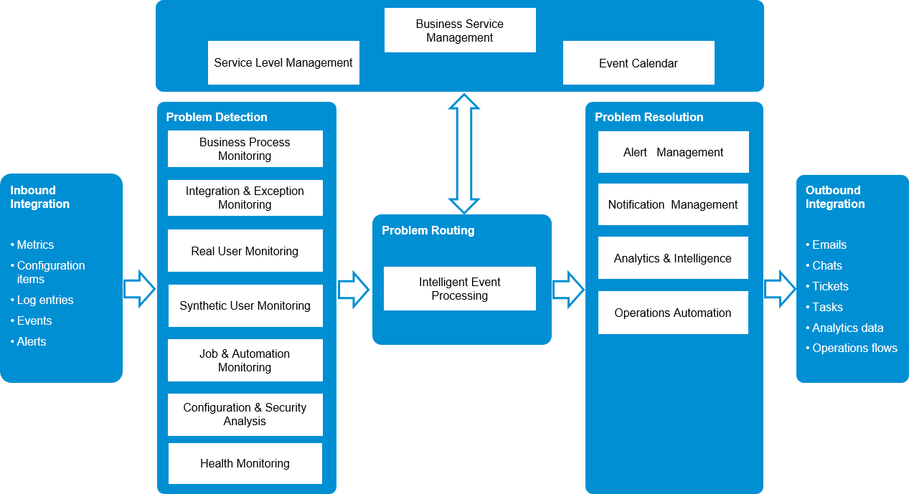

<!-- loiof7f297754e9c4187b3f92b0fca45d8ce -->

# Operate

SAP Cloud ALM helps you to implement and operate intelligent cloud and hybrid business solutions. You benefit from an out-of-the-box, native cloud solution running on SAP BTP, designed as the central entry point to manage your complete SAP landscape with content-driven guided implementation and highly automated operations. See [SAP Cloud ALM](https://support.sap.com/en/alm/sap-cloud-alm.html).

To support the Operate phase of the software lifecycle, SAP Cloud ALM for operations provides a personalized and unified operations user experience. You can use purpose-driven different monitoring, analysis, and management use cases optimized for certain operations aspects. SAP Cloud ALM for operations empowers you to understand the health of your SAP business solutions and acts as collaboration platform between lines of business and IT. See [SAP Cloud ALM for Operations](https://support.sap.com/en/alm/sap-cloud-alm/operations.html?anchorId=section).

Use the powerful Intelligent Event Processing, embedded analytics, and intelligence functionality with a large variety of inbound and outbound integration. Synthetic User Monitoring monitors the performance and availability of web applications from a client-side perspective based on Selenium-based scripts. Business Service Management consolidates all operational events at business service level and shows them in a well-arranged Event Calendar.

Specifically for Java and Node.js custom-built applications in SAP BTP, Cloud Foundry runtime, there are the Data Collection Instrumentation Libraries based on Open Telemetry designed to enable the data collection infrastructure in SAP Cloud ALM. With these libraries, you can collect data for the following use cases:

-   Real User Monitoring

    Leveraging both frontend and backend measurements on single request level.

-   Health Monitoring

    Gaining insights on application health based on technical metrics.

-   Integration and Exception Monitoring

    Collecting and reacting on exceptions raised by the application.

-   Job and Automation Monitoring

    Monitoring of SAP Job Scheduling Service jobs.

