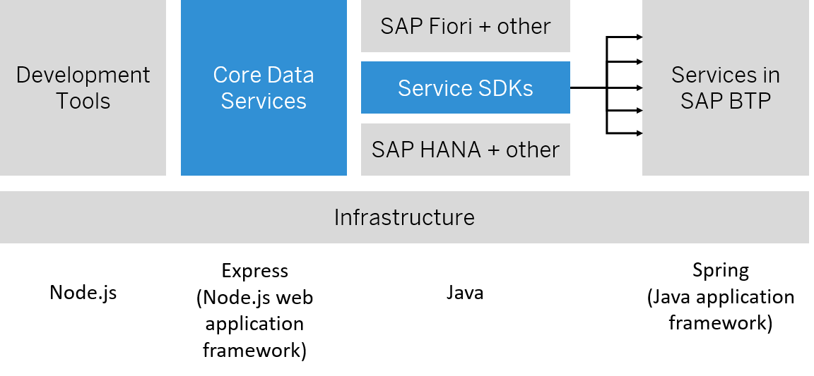

<!-- loio696ec2328d02468eb1455c280e1eb969 -->

# SAP Cloud Application Programming Model \(CAP\)

<a name="loio696ec2328d02468eb1455c280e1eb969__section_w2m_ksx_lxb"/>

## Overview

The SAP Cloud Application Programming Model \(CAP\) is a framework of languages, libraries, and tools for building enterprise-grade services and applications. It guides developers along a path of proven best practices and a great wealth of out-of-the-box solutions to recurring tasks.

CAP-based projects benefit from a primary focus on domain. Instead of delving into overly technical disciplines, CAP focuses on accelerated development and safeguarding investments in a world of rapidly changing cloud technologies.

The following graphic shows that the CAP framework features a mix of proven and broadly adopted open-source and SAP technologies:

On top of open-source technologies, CAP mainly adds:

-   Core Data Services \(CDS\) as its universal modeling language for both domain models and service definitions.

-   Service SDKs and runtimes for Node.js and Java, offering libraries to implement and consume services as well as generic provider implementations serving many requests automatically.

CAP also offers mocks for many platform features, which allow fast develop-test-run cycles with minimal development runtime complexity. CAP facilitates integration scenarios by importing an API from, for example SAP S/4HANA backend or from SAP Business Accelerator Hub and running mocks for this locally.

Over time, you can add things gradually, only when they're needed. For example, you can move ahead to running your applications in close-to-productive setups for integration tests and delivery, without any change in models or code.

See [Grow as You Go](https://cap.cloud.sap/docs/get-started/grow-as-you-go) in the CAP documentation.

**Related Information**  

[Design](design-dcdc2d9.md "")

[Develop](develop-58df1d6.md "Learn more about developing applications using SAP Cloud Application Programming Model (CAP).")

[Deploy](deploy-45d5acf.md "")

[Operate](operate-34065a4.md "")

[Operating with SAP Cloud ALM](operating-with-sap-cloud-alm-f7f2977.md "")