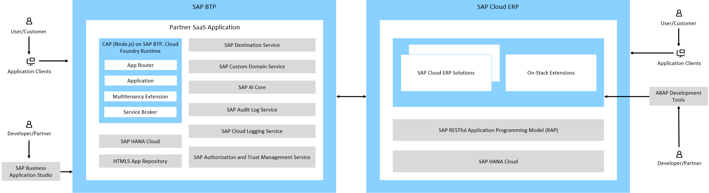

<!-- loioca02696ade7b4294a0b0c4e0fe381210 -->

# Tutorial and Reference Sample for a Cross-Stack Extension Application

The cross-stack application extension shows how SAP partners can build integrated solutions across SAP S/4HANA \(on stack\) and SAP BTP \(side by side\). It serves as a reference implementation for SAP partners, demonstrating how to build integrated solutions across multiple technology layers.

The cross-stack application extension enhances the Poetry Slam Manager application. See [Poetry Slam Event Management on SAP BTP integrated with Sales Orders on SAP S/4HANA](https://github.com/SAP-samples/cross-stack-partner-reference-extension) on GitHub.

## Scenario

The sample scenario that the Poetry Slam Event Management on SAP BTP integrated with Sales Orders on SAP S/4HANA is about organizations that struggle to connect event planning with sales activities across disconnected systems. Event managers lack real-time visibility into corporate sponsors for specific events, while sales teams manually coordinate between order management and event systems.

In the cross-stack application extension there are two main roles:

-   The event manager needs visibility which business partners sponsor each poetry slam event, requiring access to sales order details and sponsoring partner information through the Poetry Slam Manager application.
-   The sales representative creates sales orders in SAP S/4HANA, selects advertising products, assigns sponsoring partners, and links these commercial arrangements directly to specific poetry slam events.

The sales representative creates a sales order in SAP S/4HANA for event sponsorship. Then, she assigns poetry slam events directly from the sales order screen using automated value help. The event manager views the real-time sponsorship data in the Poetry Slam Manager application. Both the sales representative and the event manager navigate seamlessly between systems with deep-linking.

## Application Architecture

The key features of the application extension are:

-   Cross-stack integration: connects ABAP-based SAP S/4HANA on-stack extensions with cloud-native SAP BTP applications

-   Real-time data synchronization: bidirectional updates between sales orders and Poetry Slam events

-   In-app navigation: seamless deep linking between SAP S/4HANA and SAP BTP user interfaces

-   Value help integration: direct Poetry Slam event selection from sales order screens

-   Multitenant architecture: scalable SaaS patterns for partner solutions in Cloud ERP

The technical stack includes two sides:

-   On stack \(SAP S/4HANA\):

    > ### Remember:  
    > *These cross-stack partner reference applications are delivered through multi-off delivery to enable direct and simplified consumption. This approach allows partners to quickly access the codebase, explore the solution, and experiment without additional setup.*
    > 
    > *For productive implementations of ABAP on-stack extensions within hybrid extension scenarios, the use of scalable delivery is* strongly recommended.
    > 
    > *The partner reference applications are delivered using a Z-namespace to facilitate immediate consumption. For productive deployments, the use of a registered ABAP namespace is mandatory to ensure proper ownership, prevent naming conflicts, and support compliant distribution and lifecycle management in line with scalable delivery principles.*

    -   ABAP RESTful Application Programming Model \(RAP\) - Core framework with CDS views, behavior definitions, validations, and custom actions

    -   Custom data extensions: data elements, append structures, and field extensions

    -   Cross-system communication: outbound services, communication scenarios, and service consumption model

    -   Dynamic value help and URL navigation: seamless cross-application lookup and navigation

    -   Lifecycle and quality: GitHub content for the cross-stack extension application is pulled in partner development system using multi-off solution, ATC checks, and change history tracking

    -   UI adaptability: extending the user interface with custom fields

-   Side by side \(SAP BTP\)
    -   SAP Cloud Application Programming Model \(CAP\)

    -   Multitenant application architecture

    -   Secure destination configurations

