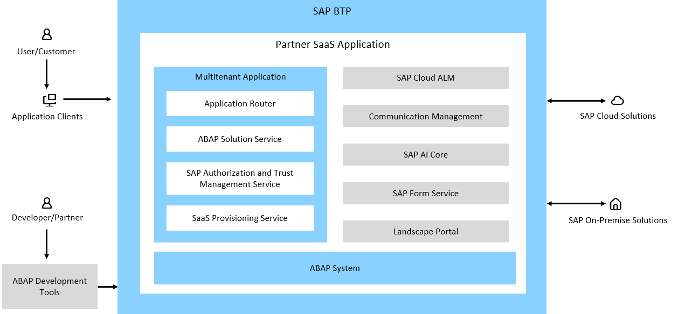
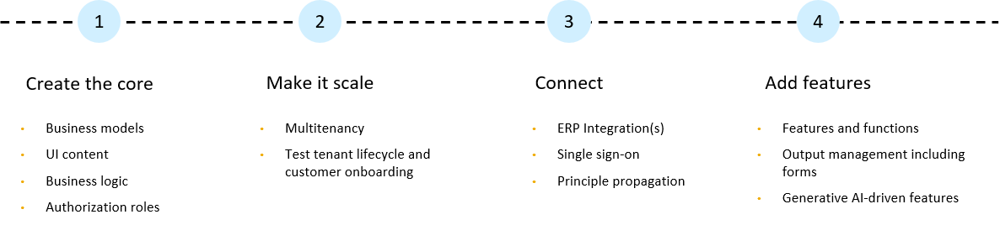

<!-- loio0e4dfa07c67c4e49b025e780aa877114 -->

# Tutorials and Reference Sample for Full-Stack ABAP Cloud Multitenant SaaS Applications for Partners

<a name="loio0e4dfa07c67c4e49b025e780aa877114__section_alh_vs5_bhc"/>

## Full-Stack Multitenant SaaS Applications for Partners

The Music Festival Manager application is a reference application for SAP partners that gives you a recommended way to become a Software-as-a-Service \(SaaS\) provider of multitenant applications based on SAP BTP. See [Partner Reference Application 'Music Festival Manager'](https://help.sap.com/docs/link-disclaimer?site=https%3A%2F%2Fgithub.com%2FSAP-samples%2Fpartner-reference-application%2F) on GitHub.

The reference application covers building, running, and integrating scalable full-stack ABAP Cloud applications using the SAP ABAP RESTful Application Programming Model \(RAP\) and adheres to the development best practices set out in the SAP BTP Developer’s Guide. It includes an ERP-agnostic design that lets you deliver your application as a side-by-side extension to consumers using any SAP solution, such as SAP S/4HANA Cloud ERP.

By using services in SAP BTP and the ABAP RESTful Application Programming Model \(RAP\), your application meets SAP standards for enterprise-class business solutions and empowers you to focus on your business logic and application domain.

The tutorials in the repository follow an incremental development approach, guiding users through the development journey. They cover:

1.  Developing the core application with a focus on business models, logic and UI, authentication and role-based authorization.
2.  Building, deploying, and provisioning your application to consumers.
3.  Integrating the application with SAP S/4HANA Cloud
4.  Adding more features to the application.

