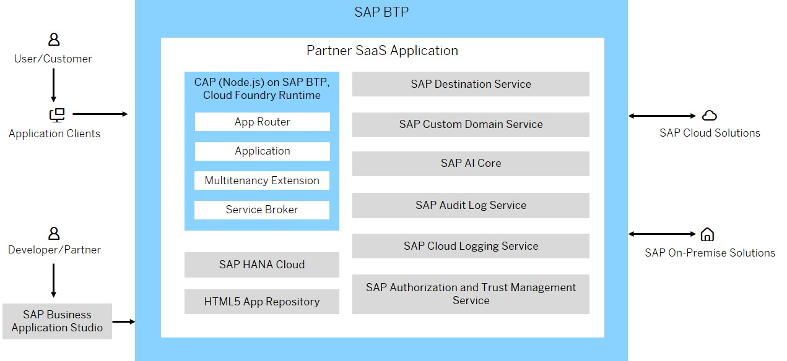
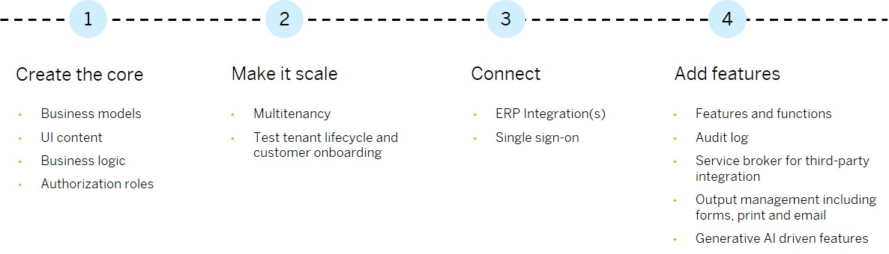
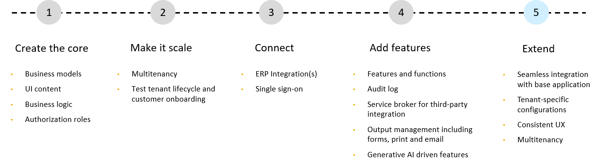

<!-- loio11d9894893cb4031a0a3de602d5bcad8 -->

# Tutorials and Reference Sample for Full-Stack Multitenant SaaS Applications for Partners

<a name="loio11d9894893cb4031a0a3de602d5bcad8__section_plh_yzb_tgc"/>

## Full-Stack Multitenant SaaS Applications for Partners

The Poetry Slam Manager application is a reference for SAP partners that provides you with a recommended way to becoming a SaaS provider of multitenant applications based on the SAP BTP. See [Partner Reference Application 'Poetry Slam Manager'](https://github.com/SAP-samples/partner-reference-application/) on GitHub.

The guidance covers building, running, and integrating scalable full-stack cloud applications using the SAP Cloud Application Programming Model \(CAP\) and adheres to the development recommendations set out in the SAP BTP Developer’s Guide. It includes an ERP-agnostic design that lets you deliver your application as a side-by-side extension to consumers using any SAP solution, such as SAP S/4HANA Cloud, SAP Business One, and SAP Business ByDesign.

By using services in SAP BTP and the SAP Cloud Application Programming Model \(CAP\), your application meets SAP standards for enterprise-class business solutions and empowers you to focus on your application domain.

The reference application and its tutorials cover a wide range of services and components in SAP BTP. You can find a list of all services in the bill of materials of the partner reference application on GitHub. See [Bill of Materials](https://github.com/SAP-samples/partner-reference-application/blob/main/Tutorials/01-BillOfMaterials.md) on GitHub.

The tutorials in the repository follow an incremental development approach, guiding users through the development journey. They cover:

1.  Developing the core application with a focus on business models and logic.
2.  Enhancing the application to a multi-customer \(multitenant\) solution.
3.  Integrating with various ERP backends.
4.  Adding more features to the application.
5.  Extending the application.

    To cater to customer-specific and industry-specific requirements, an extensibility feature is provided as part of incremental development approach, guiding users through extension journey. See [Partner Reference Application Extension](https://github.com/SAP-samples/partner-reference-application-extension).

<a name="loio11d9894893cb4031a0a3de602d5bcad8__section_fdr_xzb_tgc"/>

## Customer-Specific Extension

The Partner Reference Application Extension demonstrates how to achieve this customer flexibility by extending the Poetry Slam Manager application with enhanced catering management capabilities. By leveraging the SAP Business Technology Platform \(SAP BTP\) and the SAP Cloud Application Programming Model \(CAP\). It enables partners to build extensions that address the unique needs of individual customers while preserving the core application's functionality for other tenants and adhering to SAP standards for scalability, security, and enterprise readiness.

The Partner Reference Application Extension showcases the platform's flexibility and extensibility with features such as:

-   Seamless integration with the base application
-   Granular tenant-specific configurations to deliver personalized experiences
-   Consistent user experience across extended and core functionality
-   Secure multitenant architecture, ensuring data isolation and performance scalability

See [Partner Reference Application Extension](https://github.com/SAP-samples/partner-reference-application-extension).

