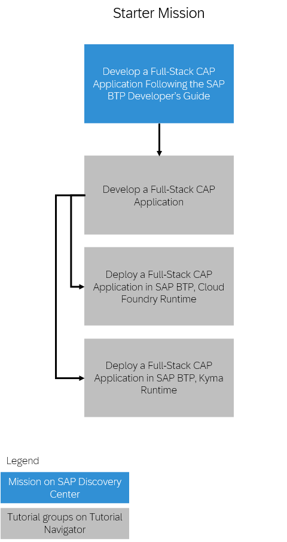
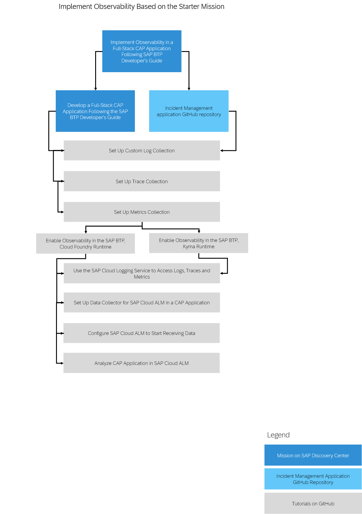
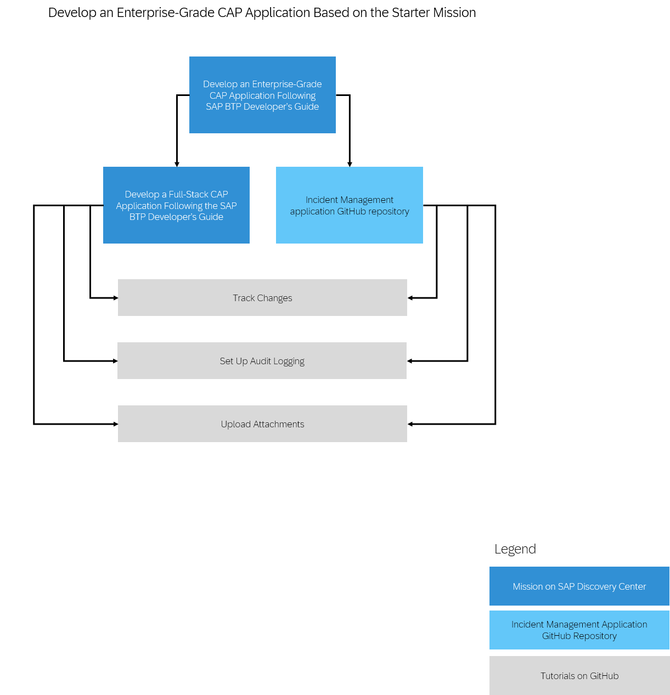

<!-- loioeb7420a2c752457687fb39ed01509ef5 -->

# Tutorials for SAP Cloud Application Programming Model

The Incident Management sample application is a showcase of the SAP Cloud Application Programming Model \(CAP\) and adheres to the development recommendations set out in the SAP BTP Developer’s Guide. Best practices are documented in step-by-step tutorials based on the Incident Management application for learning how to develop, deploy, and operate a full-stack application using CAP and SAP Fiori. The tutorials also show how to use a set of important SAP BTP services in a CAP application.

When going through the sample application, you can choose from two options to try its services and runtimes before you purchase them:

-   Free tier for SAP BTP is best for productive projects:

    -   Access a productive account

    -   Start with more than 30 free-tier services and upgrade from free to paid plans

    -   Accelerate your ramp-up with boosters and missions that include step-by-step guidance

    The free-tier offering is available in the following consumption-based commercial models: the **SAP BTPEA** \(SAP BTP Enterprise Agreement\), the **CPEA** \(Cloud Platform Enterprise Agreement\) and **Pay-As-You-Go for SAP BTP**. See [Using Free Service Plans](https://help.sap.com/docs/btp/sap-business-technology-platform/using-free-service-plans).

-   SAP BTP trial is best for learning purposes:

    -   Gain instant and full access to a trial environment

    -   Experiment with a diverse range of more than 30 trial services for free

    -   Get started with a variety of learning materials, such as tutorials and missions

    See [Start your free 90-days trial](https://www.sap.com/registration/trial.908cb719-0e03-421c-a091-daca045f0acc.html).

Before you start using the services or runtimes, you need to manage your entitlements and add quotas to your subaccounts. See [Entitlements and Quotas](https://help.sap.com/viewer/65de2977205c403bbc107264b8eccf4b/Cloud/en-US/00aa2c23479d42568b18882b1ca90d79.html "When you purchase an enterprise account, you’re entitled to use a specific set of resources, such as the amount of memory that can be allocated to your applications.") :arrow_upper_right:.

Note that if you want to try out services for free, you need to select free tier service plans, if available. For a list of free services, check the Service Catalog at [SAP Discovery Center](https://discovery-center.cloud.sap/servicessearch/Free%20Tier/).

> ### Note:  
> There is also a free plan for the SAP BTP, Cloud Foundry runtime and SAP BTP, Kyma runtime. To use the free plans for these runtimes, you have to configure the entitlements in the SAP BTP cockpit. You have one free plan for each runtime per global account and you can assign it to one subaccount at a time.

The tutorials are grouped in missions following a specific scenario. All the missions are based on the Incident Management sample application:

-   [Starter Mission: Develop a Full-Stack CAP Application](tutorials-for-sap-cloud-application-programming-model-eb7420a.md#loioebd19b54c28c4cdfa31ad056ad02aff4)

-   [Mission: Develop a Side-by-Side CAP-Based Extension Application](tutorials-for-sap-cloud-application-programming-model-eb7420a.md#loio2289e25a0e494f03867c195454b6eaea)

-   [Mission: Implement Observability in a Full-Stack CAP Application](tutorials-for-sap-cloud-application-programming-model-eb7420a.md#loioc5636db4e969490f8313474cb4cea775)

-   [Mission: Develop an Enterprise-Grade CAP Application Following the SAP BTP Developer’s Guide](tutorials-for-sap-cloud-application-programming-model-eb7420a.md#loiob5be78656d614f91bf436d6b93b593e4)

<a name="loioebd19b54c28c4cdfa31ad056ad02aff4"/>

<!-- loioebd19b54c28c4cdfa31ad056ad02aff4 -->

## Starter Mission: Develop a Full-Stack CAP Application

The starter mission is called **Develop a Full-Stack CAP Application Following the SAP BTP Developer’s Guide** and contains tutorials grouped in the following way:

-   The [Develop a Full-Stack CAP Application](https://developers.sap.com/group.cap-application-full-stack.html) group of tutorials covers the following steps for developing the Incident Management sample application:

    -   Setting up the development environment.

    -   Building a CAP application with SAP Fiori elements user interface and a custom logic.

    -   Adding local launchpad, authorization, tests for local development and preparing for production.

-   The [Deploy a Full-Stack CAP Application in SAP BTP, Cloud Foundry Runtime](https://developers.sap.com/group.deploy-full-stack-cap-application.html) group of tutorials covers the following steps for deploying the Incident Management application in the SAP BTP, Cloud Foundry runtime:

    -   Deploying the application in a productive account in SAP BTP, Cloud Foundry runtime.

    -   Using SAP Build Work Zone, standard edition.

    -   Setting up continuous integration and delivery pipeline in SAP BTP.

-   The [Deploy a Full-Stack CAP Application in SAP BTP, Kyma Runtime](https://developers.sap.com/group.deploy-full-stack-cap-kyma-runtime.html) group of tutorials covers the following steps for deploying the Incident Management application in the SAP BTP, Kyma runtime:

    -   Deploying the application in a productive account in SAP BTP, Kyma runtime.

    -   Using SAP Build Work Zone, standard edition.

    -   Setting up continuous integration and delivery pipeline in SAP BTP.

See the [Develop a Full-Stack CAP Application Following the SAP BTP Developer’s Guide](https://discovery-center.cloud.sap/protected/index.html#/missiondetail/4327/4608) mission at SAP Discovery Center.

This image is interactive. Click the highlighted areas so you open the respective tutorial or mission.

<a name="loio2289e25a0e494f03867c195454b6eaea"/>

<!-- loio2289e25a0e494f03867c195454b6eaea -->

## Mission: Develop a Side-by-Side CAP-Based Extension Application

Using the SAP BTP Developer’s Guide you can implement side-by-side SAP Cloud Application Programming Model \(CAP\)-based extension applications and deploy them in SAP BTP. The **Develop a Side-by-Side CAP-Based Extension Application Following the SAP BTP Developer’s Guide** mission includes tracks for a remote service connectivity and eventing. In the scenario, an SAP S/4HANA Cloud system is used. If you don't have such a system and you still want to try out the mission, you can use a mock server instead. Depending on what you choose, there are 8 different options:

-   Connect to a remote service

    -   Option 1a: SAP BTP, Cloud Foundry runtime and mock server

    -   Option 2a: SAP BTP, Cloud Foundry runtime and SAP S/4HANA Cloud

    -   Option 3a: SAP BTP, Kyma runtime and mock server

    -   Option 4a: SAP BTP, Kyma runtime and SAP S/4HANA Cloud

-   Implement eventing

    -   Option 1b: SAP BTP, Cloud Foundry runtime and mock server

    -   Option 2b: SAP BTP, Cloud Foundry runtime and SAP S/4HANA Cloud

    -   Option 3b: SAP BTP, Kyma runtime and mock server

    -   Option 4b: SAP BTP, Kyma runtime and SAP S/4HANA Cloud

Out of these 8 options, you can choose one option for the remote service and the corresponding option for the eventing. If you are interested in the remote service connectivity, you don't have to finish the eventing option as well. However, if you are interested in the eventing part, you have to finish the respective remote service connectivity option.

See [Develop a Side-by-Side CAP-Based Extension Application Following the SAP BTP Developer’s Guide](https://discovery-center.cloud.sap/protected/index.html#/missiondetail/4426/4712/).

This image is interactive. Click the highlighted areas so you open the respective tutorial or mission.

<a name="loioc5636db4e969490f8313474cb4cea775"/>

<!-- loioc5636db4e969490f8313474cb4cea775 -->

## Mission: Implement Observability in a Full-Stack CAP Application

You can add observability to the Incident Management application. Observability helps make informed decisions using real-time data like logs, metrics, traces, and events. It provides insights into SAP and customer systems to improve efficiency, scalability, resilience, and availability.

For detailed observability data, use SAP Cloud Logging. SAP Cloud Logging allows you to analyze logs, metrics, and traces to understand the performance of your SAP BTP workload in the SAP BTP, Cloud Foundry, and SAP BTP, Kyma environments.

See [Implement Observability in a Full-Stack CAP Application Following SAP BTP Developer’s Guide](https://discovery-center.cloud.sap/protected/index.html#/missiondetail/4432/4718/).

This image is interactive. Click the highlighted areas so you open the respective tutorial or mission.

<a name="loiob5be78656d614f91bf436d6b93b593e4"/>

<!-- loiob5be78656d614f91bf436d6b93b593e4 -->

## Mission: Develop an Enterprise-Grade CAP Application Following the SAP BTP Developer’s Guide

You can develop enterprise-grade CAP applications and deploy them in SAP BTP. The **Develop an Enterprise-Grade CAP Application Following the SAP BTP Developer’s Guide** mission includes options for tracking changes, adding audit logs, and uploading attachments.

See [Develop an Enterprise-Grade CAP Application Following the SAP BTP Developer’s Guide](https://discovery-center.cloud.sap/protected/index.html#/missiondetail/4431/4717/).

This image is interactive. Click the highlighted areas so you open the respective tutorial or mission.

