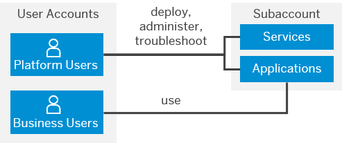

<!-- loiocc1c676b43904066abb2a4838cbd0c37 -->

# User and Member Management

On SAP BTP, member management happens at all levels from global account to environment, while user management is done for business applications.

<a name="loiocc1c676b43904066abb2a4838cbd0c37__section_ygb_5xw_jlb"/>

## User Accounts

A user account corresponds to a particular user in an identity provider, such as the default identity provider or a custom tenant of the Identity Authentication service.

**User accounts** enable users to log on to SAP BTP and access subaccounts and use services according to the permissions given to them.

Before diving into the different user and member management concepts, it's important to understand the difference between the different types of users we’re referring to: **Platform users** and **business users**.

**Related Information**  

[Working with Users](https://help.sap.com/viewer/65de2977205c403bbc107264b8eccf4b/Cloud/en-US/2c91f88e60ea4677a076212085b42d02.html "In the SAP BTP cockpit, you can see the users of your global account or subaccount, user-related identity provider information, and their authorizations. In a user's overview, you can create and delete users, and assign role collections. You can also display an overview of the role collections, where you can drill down all the way to the role, and see the application that the role is belongs to.") :arrow_upper_right:

[Roles and Role Collections](https://help.sap.com/viewer/65de2977205c403bbc107264b8eccf4b/Cloud/en-US/14a877c6e2f14832999df500ffa6e05e.html "Usually a role collection consists of one or multiple roles. You can use the SAP BTP cockpit to add or remove roles.") :arrow_upper_right:

[Attributes](https://help.sap.com/viewer/65de2977205c403bbc107264b8eccf4b/Cloud/en-US/713f52ac36a041ef8fdc72560d6cfbcd.html "Attributes use information that is specific to the user, for example the user's country. If the application developer in the Cloud Foundry environment of SAP BTP has created a country attribute to a role, this restricts the data a business user can see based on this attribute.") :arrow_upper_right:

[Trust and Federation with Identity Providers](https://help.sap.com/viewer/65de2977205c403bbc107264b8eccf4b/Cloud/en-US/cb1bc8f1bd5c482e891063960d7acd78.html "When setting up accounts you need to assign users. While we provide you with your first users to get you started, your organization has identity providers that you want to integrate.") :arrow_upper_right:

