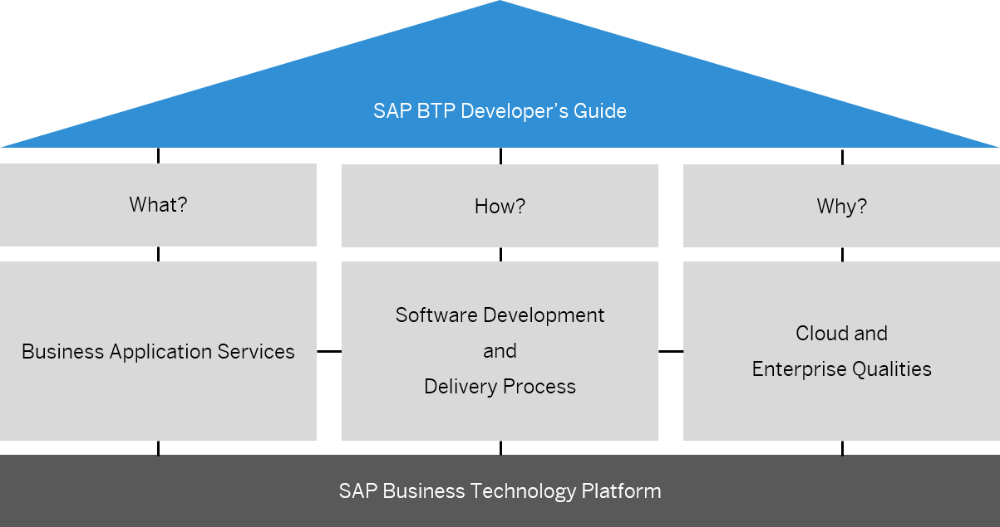

<!-- loioba26ec41130d4835aef2265ad3d3704e -->

# What Is SAP BTP Developer’s Guide?

Learn about the SAP BTP Developer’s Guide and how you can use it to improve the process of implementing a business application on SAP BTP.

<a name="loioba26ec41130d4835aef2265ad3d3704e__section_w2m_ksx_lxb"/>

## Overview

The goal of the SAP BTP Developer’s Guide is to help you implement business applications on SAP BTP. This guide explains the building blocks for developing, delivering, and integrating business applications.

Development projects for business applications have similar characteristics. Standardized development guidance is driving developer efficiency.

Based on the experiences of successful business applications, this guide condenses best practices and technologies that can be safely recommended to you. These recommendations include:

-   A blueprint with a curated list of services that implement the standard nucleus of SAP business applications on SAP BTP.

-   An automated SAP BTP Infrastructure setup that handles provisioning, management, and configuration of resources on SAP BTP.

-   A standard set of technologies that ensure smooth integrations.

-   Guidance for delivering SAP cloud qualities and intelligent enterprise suite qualities.

The SAP BTP Developer’s Guide recommends the ABAP Cloud and SAP Cloud Application Programming Model \(CAP\) as the best architecture styles to implement for business applications. Both programming models integrate with SAP BTP services.

The SAP BTP Developer’s Guide complements existing documentation, such as the Best Practices for SAP BTP guide, by providing guidance concerning the recommended process to implement business applications on SAP BTP, especially for developers. See [Best Practices for SAP BTP](https://help.sap.com/docs/btp/best-practices/best-practices-for-sap-btp?version=Cloud).

Another resource is the SAP BTP Guidance Framework - this is the central access point for architects, developers, and administrators to build and run enterprise-grade solutions on SAP BTP. It comprises decision guides, reference architectures, methodologies, recommendations, and DevOps principles. See [SAP BTP Guidance Framework](https://help.sap.com/docs/sap-btp-guidance-framework/guidance-framework/what-is-sap-btp-guidance-framework).

<a name="loioba26ec41130d4835aef2265ad3d3704e__section_f14_4xy_wyb"/>

## ABAP Cloud

ABAP Cloud reflects the modern way to develop ABAP. It allows you to build lifecycle-stable and cloud-ready business applications, services, and extensions.

ABAP Cloud provides tools and techniques that ensure cloud qualities, promotes new technologies, contains a cloud-optimized subset of the ABAP language, and makes upgrade cycles easier by a clear separation between custom code and SAP code by only using released APIs and objects.

<a name="loioba26ec41130d4835aef2265ad3d3704e__section_opl_c5x_tyb"/>

## SAP Cloud Application Programming Model

The SAP Cloud Application Programming Model \(CAP\) is a framework of languages, libraries, and tools for building enterprise-grade services and applications. It supports Java \(with Spring Boot\), JavaScript, and TypeScript \(with Node.js\), which are some of the most widely adopted languages. CAP guides developers along a path of proven best practices and a great wealth of out-of-the-box solutions to recurring tasks.

CAP-based projects benefit from a primary focus on the domain. Instead of delving into overly technical disciplines, CAP focuses on accelerated development and safeguarding investments in a world of rapidly changing cloud technologies.

Here are some of the benefits that come with the SAP Cloud Application Programming Model \(CAP\):

-   Built-in best practices

-   Support for Visual Studio Code and SAP Business Application Studio tools

-   Safeguarded application development investments

-   No runtimes lock-in

-   Reuse and integration of SAP BTP application services

-   Latest UX and themes

<a name="loioba26ec41130d4835aef2265ad3d3704e__section_mjy_2kj_fzb"/>

## SAP Build Code

SAP Build Code offers an AI-powered cloud development environment specifically tailored for SAP Cloud Application Programming Model \(CAP\) and SAPUI5 developers and supporting JavaScript, TypeScript and Java.

By seamlessly integrating coding, testing, and application management, it streamlines the application development process on SAP BTP. SAP Build Code combines SAP Business Application Studio with the most essential services and SDKs on SAP BTP.

With the integration of Joule, the innovative AI copilot of SAP, SAP Build Code enables automatic generation of application code, data models, services, and sample data.

Using SAP Build Code ensures adherence to the best practices and guidance outlined in the SAP BTP Developer's Guide.

<a name="loioba26ec41130d4835aef2265ad3d3704e__section_mfx_qws_zxb"/>

## Contribute to the SAP BTP Developer’s Guide

> ### Tip:  
> The English version of this guide is open for contributions and feedback using GitHub. This allows you to get in contact with responsible authors of SAP Help Portal pages and the development team to discuss documentation-related issues. To contribute to this guide, or to provide feedback, choose the corresponding option on SAP Help Portal:
> 
> -   *Feedback* \> *Create issue*: Provide feedback about a documentation page. This option opens an issue on GitHub.
> 
> -   *Feedback* \> *Edit page*: Contribute to a documentation page. This option opens a pull request on GitHub.
> 
> 
> You need a GitHub account to use these options.
> 
> More information:
> 
> -   [Contribution Guidelines](https://help.sap.com/docs/open-documentation-initiative/contribution-guidelines/readme.html)
> 
> -   [Introduction Video](https://www.youtube.com/watch?v=WJ0oarMlVW4)
> 
> -   [Introduction Blog Post](https://blogs.sap.com/2021/11/29/sap-btp-documentation-goes-github-new-collaboration-process/)

